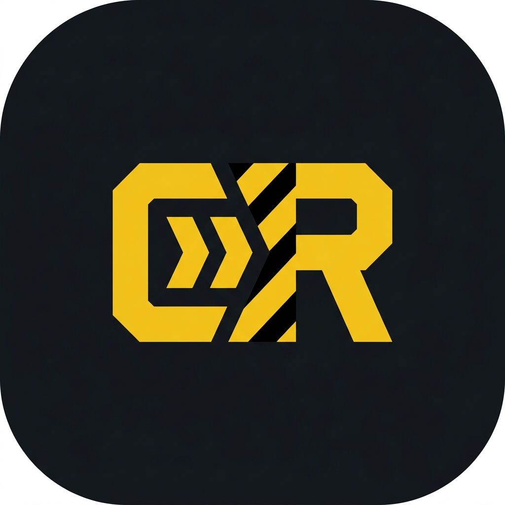
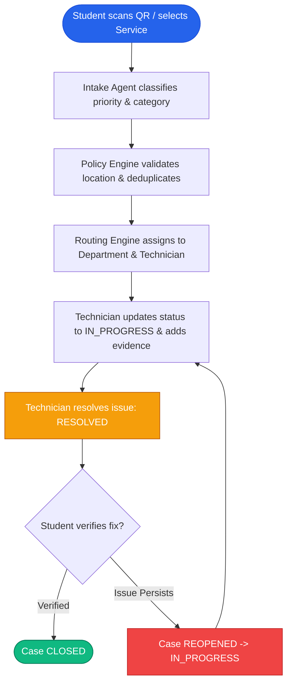
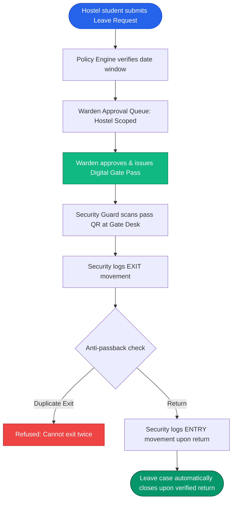
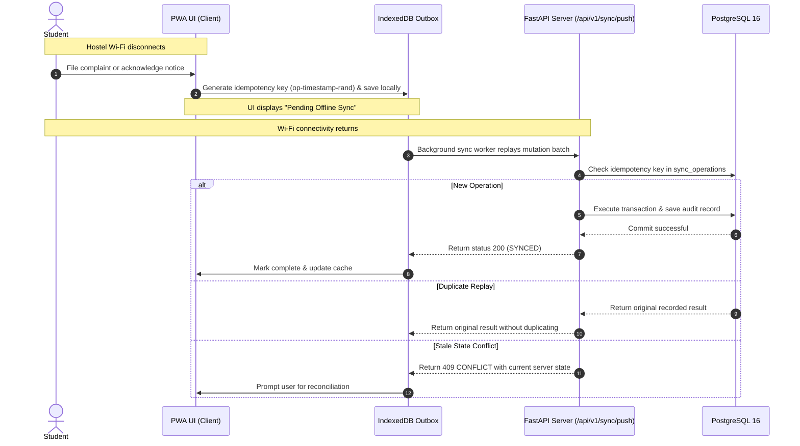
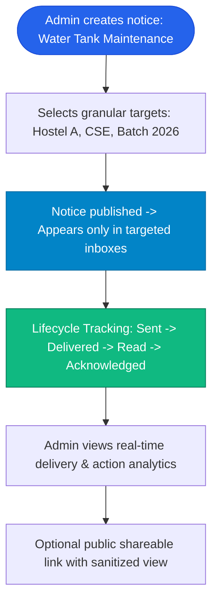
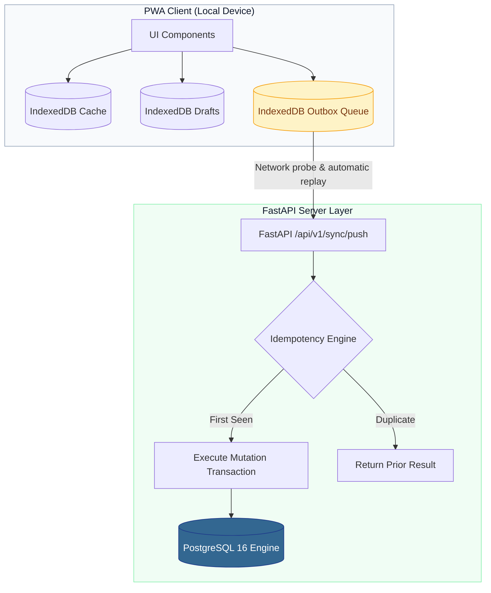
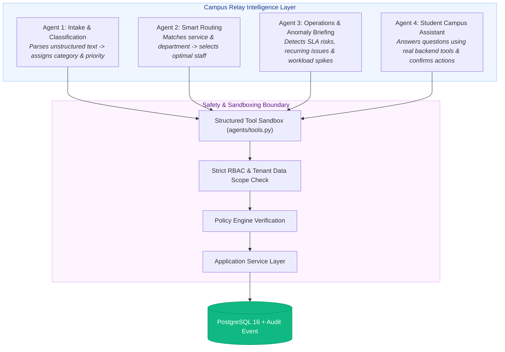

<p align="center">
  
</p>

<h1 align="center">🏛️ Campus Relay</h1>

<p align="center">
  <strong>A resilient operating layer for everyday campus operations.</strong><br>
  <em>Engineered by <strong>Crystal Studio Labs</strong> for BPUT Hackathon 2026 — Problem Statement 07 (Fretbox)</em>
</p>

<p align="center">
  <!-- Core Stack Badges -->
  <a href="https://fastapi.tiangolo.com"></a>
  <a href="https://www.python.org"></a>
  <a href="https://www.postgresql.org"></a>
  <a href="https://www.sqlalchemy.org"></a>
  <a href="https://react.dev"></a>
  <a href="https://www.typescriptlang.org"></a>
  <a href="https://vitejs.dev"></a>
  <a href="https://www.docker.com"></a>
</p>

<p align="center">
  <!-- Architecture & Operational Badges -->
  <a href="#offline-first-architecture--synchronization"></a>
  <a href="#offline-first-architecture--synchronization"></a>
  <a href="#role-based-access-control-rbac--pre-configured-demo-accounts"></a>
  <a href="#architectural-philosophy"></a>
  <a href="#workflow-c-leave-approval-digital-gate-pass--anti-passback"></a>
  <a href="#controlled-ai-agents--operations-layer"></a>
</p>

<p align="center">
  <!-- UX, Standards & Governance Badges -->
  <a href="#frontend-design-system--bright-institutional"></a>
  <a href="#frontend-design-system--bright-institutional"></a>
  <a href="#configuration-reference"></a>
  <a href="https://bput.ac.in"></a>
  <a href="https://github.com/Crystal-Studio-Labs/Campus-Relay"></a>
  <a href="mailto:connect.crystalstudio@gmail.com"></a>
</p>

---

## 📑 Table of Contents

1. [Executive Summary](#executive-summary)
2. [Architectural Philosophy](#architectural-philosophy)
3. [Key Highlights & Competitive Reality](#key-highlights--competitive-reality)
4. [Master End-to-End Workflows](#master-end-to-end-workflows)
5. [Role-Based Access Control (RBAC) & Pre-configured Demo Accounts](#role-based-access-control-rbac--pre-configured-demo-accounts)
6. [Offline-First Architecture & Synchronization](#offline-first-architecture--synchronization)
7. [Controlled AI Agents & Operations Layer](#controlled-ai-agents--operations-layer)
8. [Frontend Design System & Bright Institutional](#frontend-design-system--bright-institutional)
9. [Tech Stack](#tech-stack)
10. [Repository Structure](#repository-structure)
11. [Quick Start Guide](#quick-start-guide)
    - [Option A: One-Click Windows Batch Execution (Recommended)](#option-a-one-click-windows-batch-execution-recommended)
    - [Option B: Manual Setup](#option-b-manual-setup)
12. [Configuration Reference](#configuration-reference)
13. [End-to-End Automated Verification Suite](#end-to-end-automated-verification-suite)
14. [API Surface & Interactive Documentation](#api-surface--interactive-documentation)
15. [One-Click Deployment](#-one-click-deployment)
16. [Contributing](#-contributing)
17. [Security Policy](#-security)
18. [Star History](#-star-history)
19. [License & Governance](#-license)
20. [Contact & Support](#-contact--institutional-support)

---

## 🎯 Executive Summary

Campus operations across universities and colleges suffer from acute fragmentation: maintenance issues rely on paper registers, academic notices are lost across unmonitored WhatsApp groups, gate passes require physical signatures on paper slips, and students without smartphones or stable internet connections are routinely left stranded.

**Campus Relay** transforms this landscape by replacing disjointed point solutions with a single, resilient operational layer. Every operational request—whether a leaking hostel washroom tap, a bonafide certificate for an education loan, a hostel leave pass, or a mess complaint—is represented as a trackable **Campus Case**, governed by formal state machines, deterministic service level agreements (SLAs), append-only audit histories, and offline-first client replication.

> [!IMPORTANT]
> **The Adoption Promise:** *Give us your college's information and this is a configurable engine you can have running within an hour of setup.*  
> Departments, hostels, rooms, staff and students are configuration and CSV import — not a fork and not a rebuild.  
> See **[`docs/guides/adoption-plan.md`](docs/guides/adoption-plan.md)** for the migration order and **[`docs/guides/setup-guide.md`](docs/guides/setup-guide.md)** for the hour-by-hour walkthrough.

---

## 🏛️ Architectural Philosophy

Campus Relay is built on foundational architectural principles designed to survive real-world campus constraints:


1. **Universal Campus Case Engine**: Adding a new campus service (e.g. sports equipment requisition, fee query, library clearance) requires configuring service catalog policies and workflow steps rather than writing a new application.
2. **Channel-Independent Access**: Whether submitted via the PWA on an Android smartphone, a desktop browser, a physical campus Kiosk, an assisted helpdesk operator, or an AI agent, every request enters the same unified case engine.
3. **Local-First & Offline Resilience**: Hostels and classrooms frequently have weak or zero Wi-Fi. The Campus Relay PWA works offline using local IndexedDB storage, queues mutations with client-side idempotency keys, and synchronizes transparently when connectivity returns.
4. **Append-Only Immutability**: All critical event streams—audit logs, case state transitions, gate logs, and notification delivery receipts—are append-only, enforced at both the SQLAlchemy ORM level and via PostgreSQL database triggers.
5. **No-Smartphone Fallback**: Students without smartphones or personal devices can identify themselves at campus kiosks or assisted desks using their Roll Number, where operators can file, track, or verify cases on their behalf.

---

## 📊 Key Highlights & Competitive Reality

| Capability | Legacy Campus Software / Silos | Typical Campus Management Tools | Campus Relay |
| :--- | :--- | :--- | :--- |
| **Operational Architecture** | ❌ Siloed CRUD forms for each department | ⚠️ Modular but disconnected databases | ✅ **Universal Case Engine** with unified state machine |
| **Offline Reliability** | ❌ Requires constant active internet | ⚠️ Cached read-only web views | ✅ **Local-First PWA with IndexedDB outbox & idempotent replay** |
| **Audit Integrity** | ❌ Mutable database rows, easily overwritten | ⚠️ Basic timestamp fields | ✅ **Append-only event sourcing with DB-level immutability triggers** |
| **Document Verification** | ❌ Scanned paper documents, easily forged | ⚠️ Static PDF downloads | ✅ **Verifiable PDFs with cryptographic serials & public QR verification** |
| **Gate Security** | ❌ Physical paper registers at the gate | ⚠️ Standalone gate software | ✅ **Integrated leave-to-pass workflow with anti-passback validation** |
| **Communication Layer** | ❌ Blast WhatsApp messages / notice boards | ⚠️ Generic bulk email | ✅ **Targeted delivery tracking, read receipts, and required action tracking** |
| **Campus Kiosk** | ❌ None | ⚠️ Cloned desktop portal on a tablet | ✅ **Dedicated touch-first kiosk mode with roll number lookup & timeout** |
| **AI Integration** | ❌ None or ungrounded external chatbots | ⚠️ Hallucination-prone LLM chat | ✅ **4 Controlled Agents with tool sandboxes & human-in-the-loop confirmation** |

---

## 🔄 Master End-to-End Workflows

Campus Relay includes 5 core end-to-end workflows that solve real campus operational bottlenecks:

### Workflow A: Hostel Maintenance Lifecycle



- **Physical QR Code Integration**: Every room, washroom, corridor, and lab features a privacy-preserving QR code containing only location metadata (never student PII). Scanning immediately pre-fills the complaint context.
- **Requester Verification Guard**: A case cannot be marked permanently closed by staff alone; the student must verify the resolution or it can be reopened.

### Workflow B: Verifiable Bonafide Certificate

```mermaid
flowchart TD
    A([Student requests Certificate with Purpose]) --> B[Policy Engine validates prerequisites & dues balance]
    B --> C[Enters Admin / Registrar Approval Queue]
    C --> D[Admin reviews & approves request]
    D --> E[ReportLab generates verifiable PDF with QR & Serial No]
    E --> F[Student downloads PDF from portal]
    F --> G([External authority scans QR to verify authenticity at /api/v1/documents/verify/{code}])

    style A fill:#2563eb,stroke:#1d4ed8,color:#ffffff
    style D fill:#10b981,stroke:#047857,color:#ffffff
    style E fill:#6366f1,stroke:#4338ca,color:#ffffff
    style G fill:#059669,stroke:#064e3b,color:#ffffff
```

- **Zero-Trust Document Verification**: Public endpoint confirms document validity, serial number, issue date, and student identity without exposing private academic or financial data.

### Workflow C: Leave Approval, Digital Gate Pass & Anti-Passback



- **Strict Anti-Passback**: A pass cannot be used for multiple exits or entries out of order. Gate counts update live in the Security Command Center.

### Workflow D: Offline Outbox & Idempotent Sync



### Workflow E: Targeted Notice Studio & Action Tracking



---

## 👥 Role-Based Access Control (RBAC) & Pre-configured Demo Accounts

Campus Relay enforces granular Role-Based Access Control on every API endpoint and frontend route, backed by organizational data scoping (e.g., wardens only see their assigned hostels; staff only see assigned tasks).

> [!NOTE]
> All demo accounts use the standard password: **`Campus@2026`**

| Role | Account Email | Role Scope & Responsibilities |
| :--- | :--- | :--- |
| **Super Admin** | `superadmin@campusrelay.demo` | Full platform governance, tenant configuration, role management. |
| **Administrator** | `admin@campusrelay.demo` | Operational Command Centre, campus-wide queues, SLA sweeps, audit inspection. |
| **Hostel Warden** | `warden@campusrelay.demo` | Hostel operations, leave approvals, gate pass authorizations. |
| **Department Head**| `maintenance.head@campusrelay.demo` | Department queue supervision, workload allocation, technician assignments. |
| **Staff / Technician**| `technician@campusrelay.demo` | Task execution, status updates (`IN_PROGRESS`, `RESOLVED`), work evidence submission. |
| **Security Guard** | `security@campusrelay.demo` | Gate desk operation, pass verification, exit/entry logging, live campus headcounts. |
| **Helpdesk Operator**| `helpdesk@campusrelay.demo` | Assisted service desk, student roll number lookups, proxy case filings. |
| **Student (Hosteller)**| `student@campusrelay.demo` | Personal dashboard, hostel complaints, leave requests, notice acknowledgments. |
| **Student (Day Scholar)**| `student2@campusrelay.demo` | Academic queries, certificate requests, campus facility complaints. |

---

## ⚡ Offline-First Architecture & Synchronization

Campus Relay implements a true local-first PWA architecture:



- **IndexedDB Stores**:
  - `cache`: Stores the latest server responses (cases, notices, profile, catalog context).
  - `outbox`: Holds pending mutation operations waiting for server synchronization.
  - `drafts`: Autosaves partially filled forms so no student inputs are lost if battery dies.
- **Idempotency Guarantees**: Each offline operation is assigned an immutable client-generated UUID `idempotency_key`. Replaying the same network payload dozens of times yields the exact same server record without creating duplicates.
- **Conflict Detection**: Client mutations submit their `client_base` version. If the server-side record moved to another state while the client was disconnected, the server rejects the mutation with `CONFLICT` and returns the latest state for user reconciliation.

---

## 🤖 Controlled AI Agents & Operations Layer

Rather than relying on ungrounded or hallucinating chatbots, Campus Relay deploys **4 purpose-built, controlled AI agents**:



### Dual Engine Capability:
1. **Deterministic Rules Mode (`AGENT_PROVIDER=rules`) [Default]**:
   - Zero external API dependencies, zero cost, 100% private, works completely offline.
   - Uses high-performance pattern matchers and domain heuristics to classify urgency, calculate SLA due dates, cluster recurring fault patterns, and answer tool queries.
2. **OpenAI-Compatible LLM Mode (`AGENT_PROVIDER=openai_compatible`)**:
   - Seamlessly connect any OpenAI-compatible endpoint (OpenAI, Groq, Ollama, vLLM).
   - Structured JSON schema tool calls only; if the LLM fails or network drops, it immediately falls back to the deterministic engine without user disruption.

---

## 🎨 Frontend Design System & Bright Institutional

The shipped interface is **bright institutional**: a calm, modern administration platform that reads as trustworthy to a registrar and familiar to a student.
- **Soft elevation**: white surfaces on a soft blue-grey page, generous radii and quiet shadows instead of hard plates — the content is the loudest thing on screen.
- **One confident blue for action**, green for done, amber for attention. Colour never carries meaning alone: every status chip also carries its word.
- **Sentence-case labels** and real headings, sized so a dense queue still scans.
- **Accessibility & Contrast**: WCAG AA across both themes; `--muted-ink` is a real measured colour, never faded body text.
- **Two independent axes**: *theme* (light/dark, chosen per person) and *skin* (the design language, chosen per institution). Four skins ship — modern institutional (default), engineering blueprint, government portal and university portal. See [`docs/specifications/THEMES.md`](docs/specifications/THEMES.md).
- **Fixed module navigation**: one information architecture across roles — Overview, Requests, Communication, Security, Insights, People, Stations and System — with items filtered by permission. Breadcrumbs and a quick switcher (`Ctrl`/`Cmd`+`K`) make every screen findable without hunting the sidebar.
- **Adaptive Layouts**:
  - **Mobile Experience**: Thumb-friendly bottom navigation bar, expandable sheets, compact case cards, tables that become labelled record cards.
  - **Desktop Experience**: Persistent module sidebar, high-density data tables, a five-level command centre.
  - **Kiosk Mode**: High-contrast, large touch-friendly buttons, multi-lingual prompts (English, Odia, Hindi), automatic session timeout after inactivity.

The stylesheet is layered — `tokens → base → components → app` — with one manifest (`frontend/src/styles/index.css`); the design roadmap (high-contrast theme, density switch, portable design pack) is registered in the product itself on `/setup` and `/guide?tab=themes`.

---

## 💻 Tech Stack

### Backend
- **Framework**: [FastAPI 0.115+](https://fastapi.tiangolo.com)
- **Database ORM**: [SQLAlchemy 2.0](https://www.sqlalchemy.org) with async/sync session management
- **Database Engine**: [PostgreSQL 16](https://www.postgresql.org)
- **Database Driver**: [psycopg 3 (binary)](https://www.psycopg.org/psycopg3/)
- **Schema Migrations**: [Alembic 1.14+](https://alembic.sqlalchemy.org)
- **Validation & Settings**: [Pydantic v2](https://docs.pydantic.dev) & `pydantic-settings`
- **Security & Authentication**: [PyJWT](https://pyjwt.readthedocs.io), [bcrypt](https://github.com/pyca/bcrypt/)
- **Document Generation**: [ReportLab](https://www.reportlab.com) (PDF generation) & [qrcode](https://github.com/lincolnloop/python-qrcode)
- **HTTP Engine**: [httpx](https://www.python-httpx.org) & [uvicorn](https://www.uvicorn.org)

### Frontend
- **Library**: [React 18](https://react.dev)
- **Language**: [TypeScript 5](https://www.typescriptlang.org)
- **Build Tool**: [Vite 5](https://vitejs.dev)
- **Routing**: [React Router DOM v6](https://reactrouter.com)
- **PWA / Service Worker**: [vite-plugin-pwa](https://vite-pwa-org.netlify.app) with Workbox precaching
- **Offline Database**: IndexedDB (native promised transaction wrapper)
- **Styling**: Bright-institutional design tokens, layered CSS custom properties, per-institution skin registry

---

## 📂 Repository Structure

```
Campus-Relay/
├── config.bat                 # Configuration file for batch launcher
├── run.bat                    # Master Windows launcher (concurrent backend & frontend)
├── stop.bat                   # Clean shutdown utility for background servers
├── docker-compose.yml         # Container configuration for PostgreSQL
├── .env.example               # Environment template
├── .env                       # Active application environment variables
├── config/
│   └── institution.json       # Config template a college edits (identity, skin, vocabulary, features)
├── docs/
│   ├── README.md              # Central documentation hub
│   ├── assets/                # App icon, social previews, architecture diagrams
│   ├── architecture/          # Modular monolith architecture, data models, workflows, offline sync
│   ├── guides/                # Adoption plan, setup guide, demo script, competitive gaps
│   ├── specifications/        # Configuration schema, theme specifications, UI design tokens, API docs
│   ├── deployment/            # Docker, Render, self-hosted deployment, Supabase setup
│   └── hackathon/             # BPUT Hackathon PS07 brief, Gamma pitch prompt, master prompt
├── README.md                  # Comprehensive project documentation
├── backend/
│   ├── alembic.ini            # Alembic database migration configuration
│   ├── requirements.txt       # Backend Python dependencies
│   ├── alembic/
│   │   ├── env.py             # Migration runtime environment
│   │   └── versions/          # Revision history (0001 initial, 0002 append-only guards)
│   ├── app/
│   │   ├── main.py            # FastAPI entry point, middlewares, rate-limiting, error handlers
│   │   ├── api/
│   │   │   ├── deps.py        # Dependency injection (Auth, DB, Permissions)
│   │   │   ├── serializers.py # Pydantic DTOs and JSON converters
│   │   │   └── v1/            # API Route endpoints (auth, cases, notices, gate, kiosk, admin)
│   │   ├── core/
│   │   │   ├── config.py      # Environment configuration (Pydantic BaseSettings)
│   │   │   ├── db.py          # SQLAlchemy connection engine & session factories
│   │   │   ├── permissions.py # Granular RBAC definitions & permission matrix
│   │   │   └── security.py    # Password hashing (bcrypt) & JWT issuance
│   │   ├── models/            # SQLAlchemy database domain models
│   │   │   ├── case.py        # Case, CaseEvent, CaseAssignment, CaseApproval
│   │   │   ├── comms.py       # Notice, NoticeTarget, Notification, NotificationEvent
│   │   │   ├── identity.py    # User, Student, Staff, Role, Permission
│   │   │   ├── immutability.py# Append-only ORM listeners for audit/event tables
│   │   │   ├── org.py         # Campus, Department, Branch, Batch, Hostel, Location, Asset
│   │   │   ├── security.py    # GatePass, GateLog, Document
│   │   │   └── sync.py        # Device, SyncOperation
│   │   ├── seed/
│   │   │   └── seed_data.py   # Deterministic campus dataset seeder & demo accounts
│   │   └── services/          # Business logic engines
│   │       ├── case_engine.py # Core Case Lifecycle State Machine
│   │       ├── routing.py     # Departmental and staff assignment routing
│   │       ├── policy.py      # Automated policy validation & prerequisite checks
│   │       ├── sla.py         # SLA calculations, targets, and sweeps
│   │       ├── documents.py   # ReportLab verifiable PDF generator
│   │       ├── gate.py        # Pass verification, anti-passback and gate logs
│   │       ├── sync.py        # Server-side offline reconciliation engine
│   │       └── agents/        # Controlled AI agents (intake, ops, assistant, provider)
│   └── scripts/
│       └── e2e_demo.py        # Complete end-to-end automated test suite
└── frontend/
    ├── package.json           # Frontend dependencies and npm scripts
    ├── tsconfig.json          # TypeScript compilation settings
    ├── vite.config.ts         # Vite build, PWA manifest, and reverse proxy setup
    ├── index.html             # Single-page application root HTML
    ├── public/                # Static assets, PWA icons
    └── src/
        ├── App.tsx            # Permission-aware client router
        ├── main.tsx           # Application bootstrapping
        ├── components/        # Reusable UI widgets (Assistant, CaseCard, Timeline, UI)
        ├── layouts/           # Responsive shells (AppShell, KioskShell)
        ├── lib/               # Client utilities (api, idb, offline, sync, i18n, tours, institution)
        ├── pages/             # Route views (student, admin, staff, security, kiosk, helpdesk)
        ├── theme/             # Skin & theme registry (shipped + planned design languages, roadmap)
        ├── state/             # Context hooks (session, theme, guide, institution)
        └── styles/            # Layered stylesheet: index → tokens / base / components / app
```

---

## 🚀 Quick Start Guide

### Option A: One-Click Windows Batch Execution (Recommended)

Campus Relay includes an intelligent, zero-configuration master launcher that orchestrates PostgreSQL, database migrations, demo data seeding, the backend FastAPI server, and the frontend Vite PWA concurrently.

1. **Configure Environment (Optional)**:
   Review `config.bat` if you need custom ports or paths. By default, it automatically detects your virtual environment (`backend\.venv`) and system tools:
   ```bat
   REM config.bat is already pre-configured for localhost:8000 and localhost:5173
   ```

2. **Launch Campus Relay**:
   Double-click `run.bat` or execute in PowerShell / Command Prompt:
   ```powershell
   .\run.bat
   ```
   > [!TIP]
   > **What `run.bat` automates:**
   > - Detects Python 3.10+ runtime and project virtual environment.
   > - Detects Node.js and installs frontend `node_modules` if missing.
   > - Probes PostgreSQL on port 5432; automatically starts Docker Compose database container if available.
   > - Applies database migrations (`alembic upgrade head`).
   > - Automatically seeds realistic campus demo data if the database is unpopulated.
   > - Launches the FastAPI backend API on `http://127.0.0.1:8000`.
   > - Launches the Vite PWA frontend on `http://localhost:5173`.
   > - Opens your default web browser directly into Campus Relay.
   > - Displays an interactive controller dashboard in your console.

3. **Clean Shutdown**:
   Press `[S]` in the `run.bat` controller menu, or double-click `stop.bat` to gracefully terminate both background servers:
   ```powershell
   .\stop.bat
   ```

---

### Option B: Manual Setup

If you prefer running components individually in separate terminal sessions:

#### Step 1: Start PostgreSQL
Using Docker:
```bash
docker compose up -d db
```
*Or ensure a local PostgreSQL server is running on `localhost:5432` with user `campus`, password `campus`, database `campus_relay`.*

#### Step 2: Configure and Run Backend
1. Open terminal in `backend/`:
   ```bash
   cd backend
   ```
2. Activate your virtual environment:
   ```powershell
   # Windows PowerShell
   .\.venv\Scripts\Activate.ps1
   ```
3. Install backend dependencies (if not already installed):
   ```bash
   pip install -r requirements.txt
   ```
4. Run database migrations:
   ```bash
   alembic upgrade head
   ```
5. Seed demo data:
   ```bash
   python -m app.seed.seed_data
   ```
6. Start the FastAPI development server:
   ```bash
   uvicorn app.main:app --host 127.0.0.1 --port 8000 --reload
   ```
   The backend API will be live at `http://127.0.0.1:8000`.

#### Step 3: Run Frontend PWA
1. Open a new terminal in `frontend/`:
   ```bash
   cd frontend
   ```
2. Install dependencies (if needed):
   ```bash
   npm install
   ```
3. Start the Vite development server:
   ```bash
   npm run dev
   ```
4. Open `http://localhost:5173` in your browser.

---

## ⚙️ Configuration Reference

Configuration has two layers. **Institution configuration** — the template that makes any college adoptable without forking — lives in `config/institution.json` (identity, design language, vocabulary, languages, station behaviour, module switches, accessibility guardrails). It is served by `GET /api/v1/institution`, editable without a rebuild, and documented in **[`docs/specifications/CONFIGURATION.md`](docs/specifications/CONFIGURATION.md)**. Administrators can inspect and reload it live on the **Institution setup** screen (`/setup`).

**Environment variables** (in `.env`) carry secrets and infrastructure:

| Environment Variable | Default Value | Description |
| :--- | :--- | :--- |
| `POSTGRES_USER` | `campus` | PostgreSQL username |
| `POSTGRES_PASSWORD` | `campus` | PostgreSQL password |
| `POSTGRES_DB` | `campus_relay` | PostgreSQL database name |
| `POSTGRES_HOST` | `localhost` | PostgreSQL host address |
| `POSTGRES_PORT` | `5432` | PostgreSQL port |
| `APP_ENV` | `development` | Environment mode (`development`, `demo`, `production`) |
| `APP_SECRET_KEY` | `dev-only-change-me`| Secret key for signing JWT bearer tokens |
| `ACCESS_TOKEN_EXPIRE_MINUTES`| `720` | Session token validity duration (12 hours) |
| `CORS_ORIGINS` | `http://localhost:5173,http://127.0.0.1:5173` | Allowed CORS origins for the frontend |
| `AGENT_PROVIDER` | `rules` | AI engine: `rules` (deterministic local) or `openai_compatible` |
| `AGENT_LLM_BASE_URL` | *(empty)* | Optional LLM endpoint base URL |
| `AGENT_LLM_API_KEY` | *(empty)* | Optional LLM API key |
| `AGENT_LLM_MODEL` | *(empty)* | Optional LLM model identifier |
| `INSTITUTION_CONFIG_PATH` | *(empty)* | Optional override of the institution config file location |
| `TELEGRAM_BOT_TOKEN` | *(empty)* | Telegram bot token. When set, Telegram channel is live; users link chat id |
| `WHATSAPP_PHONE_NUMBER_ID` | *(empty)* | Meta WhatsApp Cloud API phone-number id |
| `WHATSAPP_TOKEN` | *(empty)* | Meta WhatsApp Cloud API permanent token |
| `WHATSAPP_TEMPLATE` | *(empty)* | Approved template name for institution-initiated messages |
| `PUSH_PROVIDER_URL` | *(empty)* | Web push provider endpoint (with `PUSH_VAPID_*`) |
| `DELIVERY_WORKER_ENABLED` | `true` | Runs the outbox delivery worker beside the API (off under `APP_ENV=test`) |
| `DELIVERY_POLL_SECONDS` | `10` | How often the worker drains the notification outbox |

### Notification channels

In-app is always real (stored and tracked in Postgres). External channels are optional and report themselves honestly via `GET /meta`:

- **Telegram** — a real adapter. Set `TELEGRAM_BOT_TOKEN` (from @BotFather) and the channel is live; users link a chat id from **Alerts → Preferences**.
- **WhatsApp** — a real adapter for the Meta Cloud API, but it stays unconfigured until a phone-number id, a permanent token and an approved template exist.
- **Push / SMS / email** — adapter slots with no provider configured.

Outbound provider calls never sit in a request transaction: a configured notification is written to the `notification_deliveries` outbox and drained by a background worker with retry and backoff, which records the true outcome. An unconfigured channel queues nothing and claims nothing.

---

## 🧪 End-to-End Automated Verification Suite

Campus Relay includes a comprehensive end-to-end test suite (`backend/scripts/e2e_demo.py`) that executes against a running instance of the API. It tests the complete lifecycle without mocking:

- **Hostel Maintenance**: Location QR code resolution -> complaint filing -> automated classification -> priority elevation -> staff dispatch -> in-progress execution -> technician resolution -> requester verification -> case closure -> reopen handling.
- **Bonafide Certificate**: Policy validation -> missing field rejection -> admin approval queue -> verifiable PDF generation -> byte verification -> public verification endpoint.
- **Leave & Security Desk**: Backward date rejection -> warden approval queue -> gate pass generation -> security verification -> exit movement recording -> duplicate exit rejection -> return entry recording -> automated case closure.
- **Offline Sync & Replay**: Outbox push -> idempotent creation -> replayed duplicate rejection -> offline timestamp preservation -> stale mutation conflict detection.
- **Targeted Notices**: Multi-target publishing -> student inbox delivery -> read receipts -> acknowledgment tracking -> live notice analytics -> sanitized public link sharing.
- **Admin Visibility**: Dashboard open cases -> SLA sweep & breaches -> ageing buckets (<24h, 1-3d, 3-7d, >7d) -> recurring issue pattern recognition -> staff workload tracking -> append-only audit trail verification.
- **AI Agents**: Operations briefing findings -> intake urgency classification -> campus assistant tool calling & human-in-the-loop proposals.
- **Role Isolation**: Cross-student case read rejection (HTTP 403), student admin dashboard access rejection (HTTP 403), unauthenticated request rejection (HTTP 401).

### Running the Suite:
```bash
# From project root with backend running:
cd backend
python -m scripts.e2e_demo --base-url http://127.0.0.1:8000
```
*Or simply press `[T]` in the `run.bat` controller menu.*

---

## 🌐 API Surface & Interactive Documentation

Once the backend is started, explore the full OpenAPI specification and test endpoints interactively:

- **Swagger UI (Interactive API Explorer)**:  
  [`http://127.0.0.1:8000/docs`](http://127.0.0.1:8000/docs)
- **OpenAPI Schema (Raw JSON)**:  
  [`http://127.0.0.1:8000/openapi.json`](http://127.0.0.1:8000/openapi.json)
- **System Health Endpoint**:  
  [`http://127.0.0.1:8000/api/v1/health`](http://127.0.0.1:8000/api/v1/health)

---

## 🚀 One-Click Deployment

Deploy your own instance of Campus Relay instantly using any of these platforms:

[](https://vercel.com/new/clone?repository-url=https://github.com/Crystal-Studio-Labs/Campus-Relay) [](https://render.com/deploy?repo=https://github.com/Crystal-Studio-Labs/Campus-Relay)

---

## 🤝 Contributing

Campus Relay is an engineered institutional operating layer. Please read our [Documentation Hub](docs/README.md) and architectural guides before submitting Pull Requests.

---

## 🔒 Security

If you discover a security vulnerability, please refer to our [Security Architecture](docs/architecture/security.md) or email us directly at [`connect.crystalstudio@gmail.com`](mailto:connect.crystalstudio@gmail.com) to report it responsibly.

---

## 🌟 Star History

<div align="center">
  <a href="https://star-history.com/#Crystal-Studio-Labs/Campus-Relay&Date">
    <picture>
      <source media="(prefers-color-scheme: dark)" srcset="https://api.star-history.com/svg?repos=Crystal-Studio-Labs/Campus-Relay&type=Date&theme=dark" />
      <source media="(prefers-color-scheme: light)" srcset="https://api.star-history.com/svg?repos=Crystal-Studio-Labs/Campus-Relay&type=Date" />
      
    </picture>
  </a>
</div>

---

## 📄 License

This project is developed for BPUT Hackathon 2026 — Problem Statement 07 (Fretbox) by **Crystal Studio Labs**. Licensed under the MIT License.

---

<div align="center">
  <p>Built with ❤️ by <b>Crystal Studio Labs</b></p>
  <p><sub>Shuvransu Sekhar Sahoo • Snehal Kumar Moharana • Subhankar Mohapatra • Pruthiraj Lenka</sub></p>
  <p><b>Official Contact:</b> <a href="mailto:connect.crystalstudio@gmail.com">connect.crystalstudio@gmail.com</a></p>
</div>