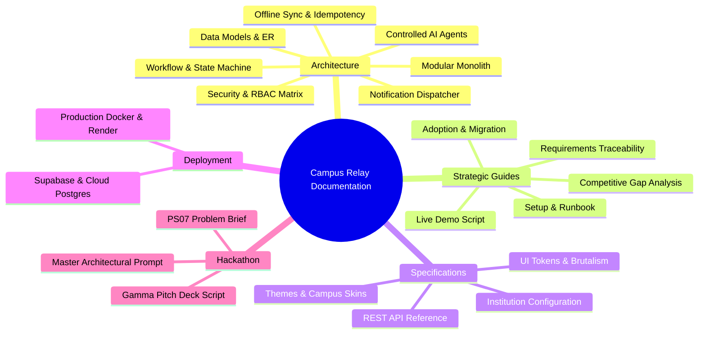

# 📚 Campus Relay — Central Documentation Hub

> **The definitive technical, architectural, operational, and deployment reference for Campus Relay.**  
> *Authored by **Crystal Studio Labs** for BPUT Hackathon 2026 — Problem Statement 07 (Fretbox)*

[](#3-architecture--core-engines-docsarchitecture)
[](#3-architecture--core-engines-docsarchitecture)
[](#documentation-conventions)
[](#-contact--institutional-support)

---

## 🧭 Documentation System Map



---

## 📂 Directory Index & Sub-System Modules

```
docs/
├── architecture/         # System design, data models, state machines, and sync protocols
├── guides/               # Onboarding, competitive gaps, requirements, and adoption roadmap
├── specifications/       # API surface, institution configuration, themes, and UI system
├── deployment/           # Production hosting, Docker self-hosting, and Supabase integration
├── hackathon/            # BPUT Hackathon PS07 problem brief, Gamma pitch prompt, master prompt
└── assets/               # Architecture diagrams, mockups, and social preview banners
```

---

## 1. 🏆 Hackathon & Jury Evaluation (`docs/hackathon/`)

> [!NOTE]
> This folder consolidates competition briefs, master build instructions, and the official pitch script for the evaluation committee.

| Document | Purpose & Highlights | Target Audience |
| :--- | :--- | :--- |
| [`hackathon/README.md`](hackathon/README.md) | Summary of BPUT Hackathon 2026 Problem Statement 07 materials. | Jury, Evaluators |
| [`hackathon/Problem_Statement_7.pdf`](hackathon/Problem_Statement_7.pdf) | Official Problem Statement 07 (Fretbox) competition brief. | Reviewers |
| [`hackathon/ppt.txt`](hackathon/ppt.txt) | 10-slide pitch deck generation script for Gamma AI in Industrial Brutalism styling. | Presentation Team |
| [`hackathon/prompt.txt`](hackathon/prompt.txt) | Master architectural specification and engineering instructions. | System Architects |

---

## 2. 📖 Guides & Adoption Strategy (`docs/guides/`)

> [!TIP]
> Use these guides for operational rollouts, onboarding new staff, running live jury demonstrations, and institutional migration.

| Document | Read it to understand | Key Outcome |
| :--- | :--- | :--- |
| [`guides/setup-guide.md`](guides/setup-guide.md) | The hour-by-hour onboarding and local development runbook. | Zero to operational in 60 mins |
| [`guides/adoption-plan.md`](guides/adoption-plan.md) | How a college migrates in four weeks: import order, workflows, rollback. | Seamless data transition |
| [`guides/demo-script.md`](guides/demo-script.md) | A runnable walkthrough for a live demonstration or jury pitch. | 12-minute deterministic pitch |
| [`guides/competitive-gap.md`](guides/competitive-gap.md) | Where a conventional CRUD tool stops vs. where Campus Relay excels. | Clear differentiation |
| [`guides/requirements.md`](guides/requirements.md) | The problem statement, required outcomes, and how each is answered. | Traceability matrix |

---

## 3. 🏛️ Architecture & Core Engines (`docs/architecture/`)

> [!IMPORTANT]
> The architectural foundation of Campus Relay is a unified case engine operating on append-only event streams.

| Document | Read it to understand | Core Components |
| :--- | :--- | :--- |
| [`architecture/architecture.md`](architecture/architecture.md) | The modular monolith, its layers, the engines, and the write path. | FastAPI + SQLAlchemy + React |
| [`architecture/data-model.md`](architecture/data-model.md) | Database schemas, relationships, append-only ledger, and multi-campus tenancy. | PostgreSQL 16 schema |
| [`architecture/workflow-engine.md`](architecture/workflow-engine.md) | Workflows, lifecycle states, policy checks, and the case state machine. | Deterministic state machine |
| [`architecture/offline-sync.md`](architecture/offline-sync.md) | The local-first IndexedDB outbox, idempotency keys, and reconciliation semantics. | Offline resilience |
| [`architecture/security.md`](architecture/security.md) | Granular RBAC matrix, JWT authentication, HMAC QR pass security, and rate limiting. | Zero-trust defenses |
| [`architecture/agent-system.md`](architecture/agent-system.md) | The four controlled AI agents (intake, ops, assistant, provider) and deterministic fallbacks. | Controlled AI layer |
| [`architecture/notification-system.md`](architecture/notification-system.md) | Multi-channel adapters (Push, Telegram, WhatsApp, Email, Kiosk) and delivery tracking. | Asynchronous delivery outbox |

---

## 4. 📐 Technical Specifications (`docs/specifications/`)

| Document | Read it to understand | Application |
| :--- | :--- | :--- |
| [`specifications/CONFIGURATION.md`](specifications/CONFIGURATION.md) | Every key in `config/institution.json`, validation rules, and runtime reloading. | Campus customization |
| [`specifications/THEMES.md`](specifications/THEMES.md) | The theme × skin model, the shipped design languages, and how to add a campus skin. | Visual branding |
| [`specifications/ui-system.md`](specifications/ui-system.md) | The industrial brutalism design system, layout tokens, and station shapes. | Design system tokens |
| [`specifications/api.md`](specifications/api.md) | Complete REST API endpoint reference grouped by functional domain. | Backend integration |

---

## 5. ☁️ Deployment & Cloud Infrastructure (`docs/deployment/`)

| Document | Read it to understand | Target Environment |
| :--- | :--- | :--- |
| [`deployment/DEPLOYMENT.md`](deployment/DEPLOYMENT.md) | Production Docker, Render, self-hosted deployment, and environment variables. | On-premises & Hybrid Cloud |
| [`deployment/SUPABASE.md`](deployment/SUPABASE.md) | Supabase-specific setup: PostgreSQL, RLS policies, connection pooling, and storage. | Managed Cloud Database |

---

## 🛡️ Documentation Conventions

- **Honesty First**: A capability that is not configured is documented as not configured. There are no invented numbers anywhere in these files.
- **Code is the Source of Truth**: Where a document and the code disagree, the code wins; the document is updated.
- **Generated Artefacts Say So**: `supabase/schema.sql` is generated by `backend/scripts/export_supabase_schema.py`; the generated section is never hand-edited.
- **Verified Claims Name Their Check**: Where a behaviour is asserted, the test or command that proves it is named (`pytest`, `scripts/e2e_demo.py`, `npm run build`).

---

### 📬 Contact & Institutional Support
- **Lead Organization**: **Crystal Studio Labs**
- **Team**: Shuvransu Sekhar Sahoo • Snehal Kumar Moharana • Pruthiraj Lenka • Manas Kumar Mallick • Bibhu Bhusan Giri • Nandita Das
- **Direct Support & Inquiries**: [`connect.crystalstudio@gmail.com`](mailto:connect.crystalstudio@gmail.com)
- **Competition Track**: BPUT Hackathon 2026 — Problem Statement 07 (Fretbox)
- **Main Repository**: [GitHub: Crystal-Studio-Labs/Campus-Relay](https://github.com/Crystal-Studio-Labs/Campus-Relay)
