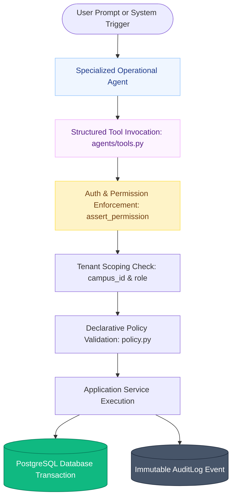
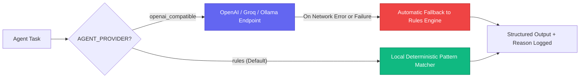

# 🤖 Controlled AI Agent Architecture

> **Purpose-Built Operations Subsystems, Tool Sandboxing & Deterministic Fallbacks**  
> *Authored by **Crystal Studio Labs** for BPUT Hackathon 2026 — Problem Statement 07 (Fretbox)*

---

## 🧭 Navigation
[Root README](../../README.md) • [Documentation Hub](../README.md) • [Architecture](./architecture.md) • [Workflow Engine](./workflow-engine.md) • [Security](./security.md)

---

Campus Relay does **not** deploy an ungrounded, hallucination-prone conversational chatbot. Instead, it introduces **four specialized, controlled operational agents**. These agents are strictly advisory: they analyze, classify, and propose structured actions. Critical state changes require explicit human confirmation.

---

## 🛡️ The Zero-Direct-Access Rule

> [!IMPORTANT]
> **No agent ever touches PostgreSQL directly.**  
> Every agent action must traverse the identical authorization, validation, and policy pipeline required of a human administrator.

---

## 👥 The Four Specialized Agents

| Agent Name | Source File | Responsibilities & Capabilities | Safety Boundary |
| :-- | :-- | :-- | :-- |
| **Intake Agent** | `agents/intake.py` | Parses complaint text, extracts location entities, infers issue category, assigns urgency, and detects duplicates. | Read-only analysis; proposes category. |
| **Routing Agent** | `agents/routing_agent.py` | Evaluates required skills and current staff workload to select the least-loaded qualified technician. | Advisory recommendation with stored reasoning. |
| **Operations Agent** | `agents/ops.py` | Crawls active cases to identify SLA breach risks, recurring asset fault clusters, and departmental bottlenecks. | Read-only analytics; generates command centre briefings. |
| **Student Assistant** | `agents/assistant.py` | Resolves student inquiries (e.g. *"Where is my certificate?"*) using structured tools and proposes verifiable actions. | Strict human-in-the-loop: write actions require `/confirm`. |

---

## 🛠️ Sandboxed Tool Pipeline (`app/services/agents/tools.py`)

The tool sandbox constitutes the sole mechanism through which agents can inspect or interact with platform state:

1. **Permission Isolation**: Every tool call validates the caller's JWT scope before query execution.
2. **Deterministic Schemas**: All inputs and outputs conform to strict Pydantic models.
3. **Audit Tracking**: Every invocation emits an `AGENT_QUERY` or `AGENT_ACTION` audit record.
4. **Human-in-the-Loop Confirmation**: When the Student Assistant recommends an action (e.g. applying for a gate pass), it returns a proposal with evidence. The action is committed only when the student invokes `POST /api/v1/agents/assistant/confirm`.

---

## ⚡ Dual-Engine Architecture

Campus Relay supports instantaneous switching between two execution modes without code modification:

1. **Deterministic Rules Mode (`AGENT_PROVIDER=rules`) [Default]**:
   - Zero external API dependencies, zero cost, completely private, and works 100% offline.
   - Leverages high-performance regex pattern matchers, keyword taxonomy trees, and historical cluster queries.
2. **Remote LLM Mode (`AGENT_PROVIDER=openai_compatible`)**:
   - Compatible with any OpenAI-compliant API (OpenAI, Groq, Ollama, vLLM).
   - Constrained to strict JSON function calling.
   - **Zero-Failure Fallback Guarantee**: If the remote model drops or produces malformed JSON, the agent immediately falls back to the deterministic rules engine and records the reason in the audit log.

---

## 🔍 Institutional Honesty Contracts

- **Provider Transparency**: `GET /api/v1/meta` reveals whether the system is operating in `rules` or `openai_compatible` mode.
- **No Fabricated Predictions**: Recurring issue detectors report concrete historical observations (e.g. *"4 ceiling fan issues reported in Hostel Block B over 30 days"*), never speculative future predictions.
- **Explicit Advice Warnings**: Every assistant response is clearly badged as an automated operational suggestion.

---

## 📡 Agent API Endpoints

| Endpoint | Method | Purpose |
| :-- | :-- | :-- |
| `/api/v1/agents/status` | `GET` | Operational status of the intelligence subsystem. |
| `/api/v1/agents/intake` | `POST` | Automated complaint classification and priority extraction. |
| `/api/v1/agents/routing/{case_id}` | `GET` | Routing analysis and staff recommendation for a case. |
| `/api/v1/agents/routing/preview` | `POST` | Preview technician allocation without committing changes. |
| `/api/v1/agents/operations/briefing` | `GET` | High-level executive briefing for Command Centre. |
| `/api/v1/agents/operations/recurring`| `GET` | Cluster analysis of recurring equipment or room defects. |
| `/api/v1/agents/assistant/ask` | `POST` | Ask student assistant; returns answer and action proposals. |
| `/api/v1/agents/assistant/confirm` | `POST` | Executes a previously proposed assistant action. |
| `/api/v1/agents/capabilities` | `GET` | Discloses active sandbox tools and supported intents. |
| `/api/v1/agents/case-summary/{case_id}` | `GET` | Generates a clean narrative summary of a case timeline. |

---

### 📬 Contact & Institutional Support
- **Lead Organization**: **Crystal Studio Labs**
- **Direct AI & Engineering Inquiries**: [`connect.crystalstudio@gmail.com`](mailto:connect.crystalstudio@gmail.com)
- **Competition Track**: BPUT Hackathon 2026 — Problem Statement 07 (Fretbox)
- **Main Repository**: [GitHub: Crystal-Studio-Labs/Campus-Relay](https://github.com/Crystal-Studio-Labs/Campus-Relay)
