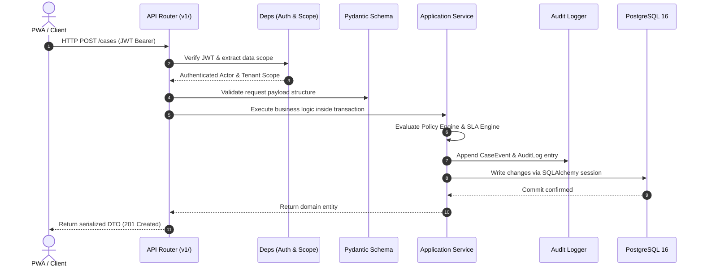

# 🏛️ System Architecture

> **The Architectural Philosophy, Engine Topology & Monolithic Design of Campus Relay**  
> *Authored by **Crystal Studio Labs** for BPUT Hackathon 2026 — Problem Statement 07 (Fretbox)*

---

## 🧭 Navigation
[Root README](../../README.md) • [Documentation Hub](../README.md) • [Data Model](./data-model.md) • [Workflow Engine](./workflow-engine.md) • [Offline Sync](./offline-sync.md)

---

Campus Relay is an engineered **modular monolith**: one FastAPI service, one PostgreSQL database, and one React PWA. There are no distributed microservices, no message brokers, and no multi-database partitioning because an operational suite of this scale requires strict transaction atomicity, low deployment friction, and complete cognitive clarity for the operational team.

---

## 💡 The Core Operational Paradigm

Every campus request — whether a leaking washroom tap, a bonafide certificate for an education loan, a hostel leave pass, or a mess complaint — is fundamentally the same entity: a **`CampusCase`**. Everything else in the system is a reusable engine that acts upon that object.

> [!NOTE]
> Adding a new campus service (such as sports equipment requisition or library clearance) requires **configuring** a service catalogue entry, a workflow, and declarative policies — not writing a new code module or database migration.

---

## 🏢 Architectural Layers

```mermaid
flowchart TD
    subgraph Clients ["Client Ecosystem (One PWA, Many Experiences)"]
        C1[Student Mobile PWA]
        C2[Admin Command Centre]
        C3[Staff Task Portal]
        C4[Gate Security Desk]
        C5[Physical Kiosk Station]
        C6[Assisted Helpdesk]
    end

    subgraph APILayer ["FastAPI API Layer (app/api/)"]
        Deps["deps.py: JWT Auth • RBAC • Data Scope Injection"]
        Serializers["serializers.py: Strict Pydantic DTOs (Never ORM Rows)"]
        Routers["v1/*.py: Domain REST Routers"]
    end

    subgraph ServiceLayer ["Domain Services & Engines (app/services/)"]
        CaseEng["case_engine: Lifecycle State Machine"]
        WfEng["workflow & policy: Prerequisites & Step Sequencing"]
        SlaEng["sla: Window Calculations & Sweep Engine"]
        RouteEng["routing: Auto Staff & Department Allocation"]
        DocEng["documents: ReportLab PDF & Serial Engine"]
        SyncEng["sync: Offline Idempotency & Reconciliation"]
        CommsEng["notifications & delivery: Asynchronous Outbox Worker"]
        AgentEng["agents/: Controlled Intake, Routing & Ops AI"]
    end

    subgraph Persistence ["Persistence & Audit Guarantee"]
        Audit["Event & Audit Ledger: AuditLog • CaseEvent • GateLog<br/><i>(Append-Only Protected by DB Triggers)</i>"]
        Postgres[("PostgreSQL 16 Engine<br/>SQLAlchemy 2.0 ORM • Alembic Migrations")]
    end

    Clients -- "HTTPS / JSON Payload" --> APILayer
    APILayer --> ServiceLayer
    ServiceLayer --> Audit
    Audit --> Postgres

    style Clients fill:#f8fafc,stroke:#cbd5e1,color:#0f172a
    style APILayer fill:#eff6ff,stroke:#bfdbfe,color:#1e3a8a
    style ServiceLayer fill:#f0fdf4,stroke:#bbf7d0,color:#14532d
    style Persistence fill:#fef2f2,stroke:#fecaca,color:#7f1d1d
```

---

## 🗄️ Backend Module Structure

| Area | Path | Responsibility & Guarantees |
| :-- | :-- | :-- |
| **Entry Point** | `app/main.py` | App factory, CORS setup, rate limiting, and safe global exception handlers. |
| **Configuration** | `app/core/config.py` | Environment settings, automatic DB URL normalization, secrets validation. |
| **Institution** | `app/core/institution.py` | Loads, parses, and hot-reloads `config/institution.json`. |
| **Database** | `app/core/db.py` | Engine pool, session factories, and `session_scope()` transaction wrapper. |
| **Permissions** | `app/core/permissions.py` | System-wide permission catalog + role-to-permission mapping matrix. |
| **Security** | `app/core/security.py` | Password bcrypt hashing and PyJWT issuance/verification. |
| **Error Handling** | `app/core/errors.py` | Typed `AppError` hierarchy with safe, sanitized client payloads. |
| **Domain Models** | `app/models/` | SQLAlchemy schemas (org, identity, workflow, case, comms, security, sync). |
| **Services** | `app/services/` | Core domain engines (case lifecycle, SLA, policies, routing, PDF, sync). |
| **API Endpoints** | `app/api/v1/` | FastAPI endpoint routers, input schemas, and output serializers. |
| **Seeder** | `app/seed/seed_data.py` | Deterministic realistic campus dataset generation for 30 days of activity. |

---

## ⚙️ The Core Domain Engines

- **Case Engine** (`services/case_engine.py`): Governs the core state machine. All illegal transitions are rejected at the service boundary so the database cannot enter an invalid state.
- **Workflow Engine** (`services/workflow.py`): Evaluates `Workflow` and `WorkflowStep` records to identify the active step and next actor.
- **Policy Engine** (`services/policy.py`): Evaluates declarative clauses against case facts and returns explicit actionable failures.
- **SLA Engine** (`services/sla.py`): Computes target due dates and derives real-time status: `ON_TIME`, `AT_RISK`, `BREACHED`, `MET`, or `MISSED`.
- **Routing Engine** (`services/routing.py`): Resolves the appropriate department and allocates the least-loaded qualified technician.
- **Notification Engine** (`services/notifications.py`): Writes in-app notifications and queues external channel payloads in the `notification_deliveries` outbox.
- **Delivery Worker** (`services/delivery.py`): Background task that drains the notification outbox with retry and exponential backoff.
- **Sync Engine** (`services/sync.py`): Replays client-queued mutations idempotently and detects concurrent version conflicts.
- **Audit System** (`services/audit.py`): Appends immutable event logs to `audit_logs` and `case_events`.
- **Controlled Agents** (`services/agents/`): Advisory AI subsystems executing strictly behind authorization and policy boundaries.

---

## 🔄 Request Flow (The Write Path)

1. **Routing & Authentication**: Router receives the call; `app/api/deps.py` resolves the user from the JWT, asserts the required permission, and injects the campus data scope.
2. **Input Validation**: `app/api/v1/schemas.py` validates the request body using Pydantic v2 schemas.
3. **Domain Execution**: The designated service executes domain operations within a managed database transaction.
4. **Audit Emission**: The service writes an immutable `AuditLog` and `CaseEvent` row.
5. **Serialization**: `serializers.py` converts ORM entities into clean DTOs. ORM objects never cross the API boundary.
6. **Transaction Finalization**: `get_db()` commits the transaction, or rolls back and re-raises on any exception.

---

## 💡 Why a Modular Monolith?

> [!IMPORTANT]
> The product is intentionally a **single operational engine with multiple client interfaces**, not a fleet of loosely coupled microservices.

Keeping the case state machine, policy engine, and audit log within a single process and transaction is what guarantees that critical operations (such as approving leave and logging who approved it) remain **strictly atomic, tamper-evident, and consistent**. Scale-out is treated as an operational concern handled by standard infrastructure (Docker, Render, or Kubernetes), not an architectural burden.

---

### 📬 Contact & Institutional Support
- **Lead Organization**: **Crystal Studio Labs**
- **Direct Inquiries**: [`connect.crystalstudio@gmail.com`](mailto:connect.crystalstudio@gmail.com)
- **Competition Track**: BPUT Hackathon 2026 — Problem Statement 07 (Fretbox)
- **Main Repository**: [GitHub: Crystal-Studio-Labs/Campus-Relay](https://github.com/Crystal-Studio-Labs/Campus-Relay)
