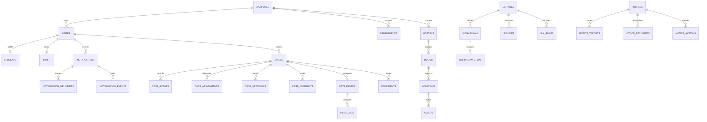

# 🗄️ Relational Data Model & Schemas

> **Entity Relationships, Multi-Campus Scoping & Append-Only Event Architecture**  
> *Authored by **Crystal Studio Labs** for BPUT Hackathon 2026 — Problem Statement 07 (Fretbox)*

[](https://www.postgresql.org)
[](https://www.sqlalchemy.org)
[](https://alembic.sqlalchemy.org)
[](#-contact--institutional-support)

---

## 🧭 Navigation
[Root README](../../README.md) • [Documentation Hub](../README.md) • [Architecture](./architecture.md) • [Workflow Engine](./workflow-engine.md) • [Security](./security.md)

---

PostgreSQL 16 serves as the authoritative system of record. SQLAlchemy 2 defines the relational schema; Alembic manages versioned migrations (`0001_initial`, `0002_append_only_guards`). Column-level `CHECK` constraints are derived dynamically from Python enums (`app/models/enums.py` via `app/models/base.py::enum_check`), ensuring that invalid status or priority values are rejected at the database level even if application validation is somehow bypassed.

---

## 📋 Core Schema Conventions

1. **Multi-Tenant Scoping**: Every campus-owned entity includes a mandatory `campus_id` foreign key, enforced at the API layer to provide ironclad tenant isolation.
2. **Dual-Key Strategy**: Surrogate integer primary keys (`SurrogateIdMixin`) for internal joins, paired with human-readable, unique business codes (e.g. `CR-ROOM-AA-101`, `CR-DEV-042`) for physical QR labels and portal displays.
3. **Audit Timestamps**: All entities inherit `TimestampMixin`, providing automated `created_at` and `updated_at` tracking.
4. **Trigger-Enforced Immutability**: Historical event tables (`audit_logs`, `case_events`, `gate_logs`, `notification_events`) are protected by PostgreSQL triggers that reject all `UPDATE` and `DELETE` queries.

---

## 🗂️ Tables by Functional Domain

### 1. Organisation Domain (`app/models/org.py`)
| Table | Description & Purpose |
| :-- | :-- |
| `campuses` | Tenant root record representing an institutional campus. |
| `departments` | Administrative divisions (Maintenance, Accounts, Registrar, Examination). |
| `branches` | Academic disciplines (Computer Science, Mechanical, Civil Engineering). |
| `academic_years`, `batches` | Academic cohorts used for targeted announcements and policies. |
| `hostels`, `blocks`, `rooms` | Hierarchical residential infrastructure. |
| `locations` | Addressable spaces (washrooms, labs, corridor water coolers) — targets of physical QR codes. |
| `assets` | Physical equipment (fans, air conditioners, projectors) with tracked lifecycle history. |

### 2. Identity & Access Control (`app/models/identity.py`)
| Table | Description & Purpose |
| :-- | :-- |
| `users` | Core authentication identity, role assignment, active campus link, and password hash. |
| `roles`, `permissions`, `role_permissions` | Fine-grained Role-Based Access Control matrix. |
| `students` | Student profile: roll number, branch, batch, assigned hostel/room, dues balance, smartphone flag. |
| `staff` | Staff profile: employee ID, department, designation, ticket capacity, live availability. |
| `devices` | Registered device fingerprints seen during sync sessions and audit tracking. |

### 3. Service Configuration & Rules (`app/models/workflow.py`)
| Table | Description & Purpose |
| :-- | :-- |
| `services` | Service catalog entries (Hostel Maintenance, Bonafide Certificate, Hostel Leave). |
| `workflows`, `workflow_steps` | Declarative multi-step state machines governing case progression. |
| `policies` | Declarative prerequisite validation rules evaluated before case creation. |
| `sla_rules` | Target resolution time windows categorized by service and priority. |

### 4. Campus Case Engine (`app/models/case.py`)
| Table | Description & Purpose |
| :-- | :-- |
| `cases` | The universal `CampusCase` entity tracking operational requests. |
| `case_events` | Append-only chronological state transition ledger. |
| `case_assignments` | Assignment records linking cases to departments and technicians. |
| `case_approvals` | Multi-tier approval queue entries (Warden, Head of Department, Registrar). |
| `case_comments` | Public student updates and internal staff notes. |
| `case_attachments` | Photographic proof, bills, and document evidence. |
| `audit_logs` | System-wide immutable security event stream (`AuditEventType`). |

> [!NOTE]
> `cases.parent_case_id` enables recursive follow-up tracking, while `cases.duplicate_group_id` links potential duplicate reports identified by the AI Intake Agent.

### 5. Communication & Broadcasts (`app/models/comms.py`)
| Table | Description & Purpose |
| :-- | :-- |
| `notices` | Official announcements, categories, priority, scheduling, and expiry dates. |
| `notice_targets` | Granular audience targeting rules (by Campus, Dept, Branch, Year, Hostel, Block, Role). |
| `notice_recipients` | Per-user delivery, read receipt, acknowledgement, and action tracking. |
| `notice_actions` | Mandatory action definitions (e.g. form submission links, consent checkboxes). |
| `notice_shares` | Cryptographic tokens for sanitized, read-only public browser sharing. |
| `notifications` | Direct in-app alerts sent to specific individuals. |
| `notification_events` | Append-only delivery lifecycle transitions (`SENT` → `DELIVERED` → `READ`). |
| `notification_deliveries` | Asynchronous provider outbox with retry counts and backoff state. |
| `notification_preferences` | User channel opt-ins (In-App, Push, Telegram, WhatsApp). |

### 6. Documents, Gate Security & Sync
| Table | Description & Purpose |
| :-- | :-- |
| `documents` | Generated certificates and letters with serial numbers and verification codes. |
| `gate_passes` | Cryptographic digital passes tied to approved hostel leaves. |
| `gate_logs` | Append-only entry and exit movements enforcing anti-passback controls. |
| `sync_operations` | Server-side record of replayed client outbox operations with idempotency keys. |

---

## 🔗 Entity Relationship Architecture



---

## 🔒 Integrity Guarantees & Constraints

- **Tenant Isolation**: Foreign key references and API dependencies enforce that users cannot query entities belonging to another `campus_id`.
- **Unique Scoping**: `uq_user_campus_email` ensures uniqueness per campus; human-readable asset and room codes (`CR-ROOM-...`) are unique per institution.
- **Foreign Key Restraints**: Deletions on operational entities are restricted (`ON DELETE RESTRICT`) to preserve audit and financial accountability.
- **Append-Only Enforcement**: PostgreSQL triggers immediately block any `UPDATE` or `DELETE` executed against `audit_logs`, `case_events`, `gate_logs`, or `notification_events`.
- **Sync Idempotency**: `sync_operations.idempotency_key` is globally unique. Replaying an identical operation from an offline device returns the previous result without duplicate insertions.

---

## ⚙️ Running Schema Migrations

```bash
# Navigate to the backend directory
cd backend

# Apply pending schema migrations to head
alembic upgrade head

# Generate a new auto-detected migration
alembic revision --autogenerate -m "Add new column or table"

# Display current database migration revision
alembic current
```

> [!TIP]
> Both Docker container startups (`backend/Dockerfile`) and Render deployments (`render.yaml`) execute `alembic upgrade head` before launching the web server, ensuring zero-downtime schema readiness.

---

### 📬 Contact & Institutional Support
- **Lead Organization**: **Crystal Studio Labs**
- **Direct Support**: [`connect.crystalstudio@gmail.com`](mailto:connect.crystalstudio@gmail.com)
- **Competition Track**: BPUT Hackathon 2026 — Problem Statement 07 (Fretbox)
- **Main Repository**: [GitHub: Crystal-Studio-Labs/Campus-Relay](https://github.com/Crystal-Studio-Labs/Campus-Relay)
