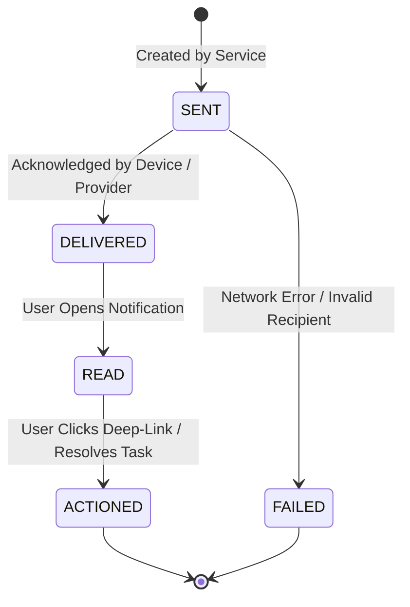
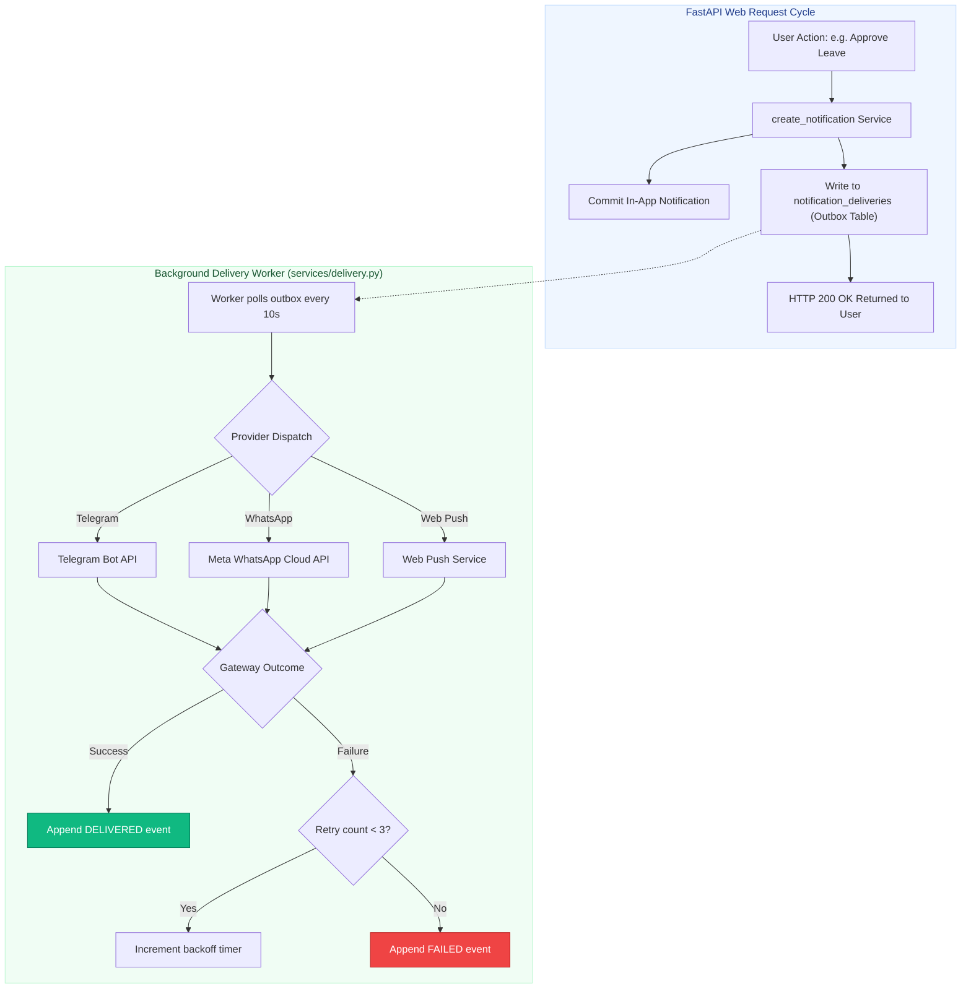

# 📢 Notification & Communication Architecture

> **Multi-Channel Dispatching, Asynchronous Outbox Worker & Guaranteed Tracking**  
> *Authored by **Crystal Studio Labs** for BPUT Hackathon 2026 — Problem Statement 07 (Fretbox)*

---

## 🧭 Navigation
[Root README](../../README.md) • [Documentation Hub](../README.md) • [Architecture](./architecture.md) • [Workflow Engine](./workflow-engine.md) • [Security](./security.md)

---

Campus Relay strictly distinguishes between **Notices** (public broadcast announcements targeted at groups) and **Notifications** (targeted system transactional alerts directed to a single user).

---

## 🔄 Delivery State Machine (`NotificationState`)

Every transactional notification is audited through a deterministic lifecycle recorded in `notification_events` (append-only):

> [!NOTE]
> Every status change emits an immutable row to `notification_events`, providing administrators with a verifiable audit log for every dispatched message.

---

## ⚡ Asynchronous Outbox Architecture

> [!IMPORTANT]
> **Outbound provider calls NEVER occur within a user's web request transaction.**  
> A slow or unresponsive third-party messaging gateway can never cause a student's complaint submission to hang or time out.

---

## 📡 Channel Adapters & Status Registry

Campus Relay implements the `NotificationAdapter` protocol across several external communication channels:

| Adapter Name | Channel | Default Status | Configuration Requirements |
| :-- | :-- | :-- | :-- |
| **`InAppAdapter`** | `IN_APP` | **Always Active** | Zero setup. Delivered directly to the user's dashboard and IndexedDB cache. |
| **`TelegramAdapter`** | `TELEGRAM` | Configurable | Set `TELEGRAM_BOT_TOKEN`. Users link their Chat ID via Alerts Preferences. |
| **`WhatsAppAdapter`** | `WHATSAPP` | Configurable | Requires Meta Cloud API `WHATSAPP_PHONE_NUMBER_ID`, `WHATSAPP_TOKEN`, and approved template. |
| **`PushAdapter`** | `PUSH` | Configurable | Requires `PUSH_PROVIDER_URL` and standard VAPID key pairs. |
| **`SmsAdapter`** | `SMS` | Reserved Slot | Reserved interface adapter slot; unconfigured by default. |
| **`EmailAdapter`** | `EMAIL` | Reserved Slot | Reserved interface adapter slot; unconfigured by default. |

### The Institutional Honesty Contract
- If an adapter has no credentials configured in `.env`, the system **never pretends** messages were sent.
- `GET /api/v1/meta` explicitly reports the live connection status of every adapter (`configured: true/false`).
- Read receipts are **never claimed** on external messaging platforms (WhatsApp/Telegram) where the provider does not offer privacy-compliant read webhooks.

---

## ⚙️ User Notification Preferences

Students and staff can configure their preferred delivery channels on a per-category basis via `PUT /api/v1/notification-preferences`:
- Maintenance Ticket Status Updates
- Official Notices & Circulars
- Mess Menu & Food Feedback
- Timetable & Class Rescheduling

> [!WARNING]
> **Safety Overrides**: Critical institutional alerts (such as disciplinary summons, emergency evacuations, or SLA escalation notifications) bypass user suppression preferences and are always delivered.

---

## 📊 Notices vs. Notifications: Architectural Comparison

| Dimension | Campus Notices (`notices`) | Personal Notifications (`notifications`) |
| :-- | :-- | :-- |
| **Audience** | Broadcast to groups (Hostel, Batch, Branch, Department) | Point-to-point to an individual user |
| **Tracking Detail** | Sent → Delivered → Read → Acknowledged → Actioned | Sent → Delivered → Read → Actioned |
| **Attachments** | Rich media (JPEG, PNG circular photos, PDF documents) | Deep-link actionable URLs |
| **Public Access** | Optional read-only cryptographic share link (`/s/{token}`) | Strictly authenticated private access only |

---

### 📬 Contact & Institutional Support
- **Lead Organization**: **Crystal Studio Labs**
- **Direct Technical Support**: [`connect.crystalstudio@gmail.com`](mailto:connect.crystalstudio@gmail.com)
- **Competition Track**: BPUT Hackathon 2026 — Problem Statement 07 (Fretbox)
- **Main Repository**: [GitHub: Crystal-Studio-Labs/Campus-Relay](https://github.com/Crystal-Studio-Labs/Campus-Relay)
