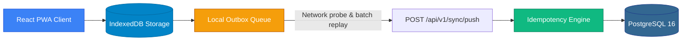
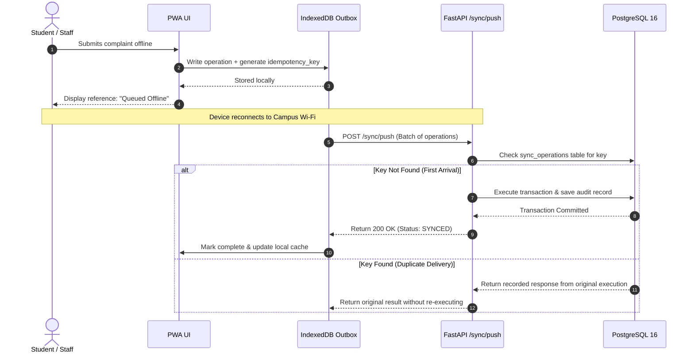
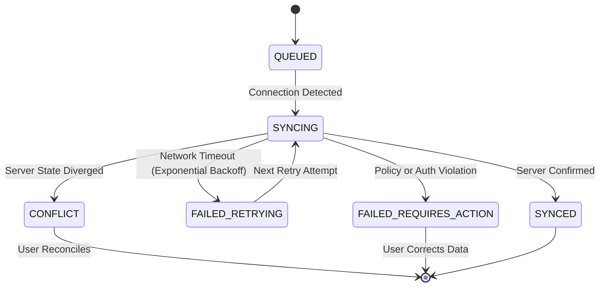

# ⚡ Offline-First Architecture & Synchronization

> **Local-First Client Storage, Deterministic Outbox & Idempotent Conflict Resolution**  
> *Authored by **Crystal Studio Labs** for BPUT Hackathon 2026 — Problem Statement 07 (Fretbox)*

[](#client-storage-architecture)
[](#idempotency--mutation-replay)
[](#conflict-resolution-semantics)
[](#-contact--institutional-support)

---

## 🧭 Navigation
[Root README](../../README.md) • [Documentation Hub](../README.md) • [Architecture](./architecture.md) • [Data Model](./data-model.md) • [Workflow Engine](./workflow-engine.md)

---

Hostels, basement laboratories, and campus gates routinely suffer from signal dead zones. Campus Relay is architected **local-first**: any user action is committed to the local device before being dispatched over the network. A mutation safely survives browser reloads, phone battery shutdowns, or days of network disconnection.

> [!IMPORTANT]
> **PostgreSQL remains the single authoritative source of truth.** IndexedDB acts as a persistent client-side outbox and cache replica — never an uncoordinated distributed database.



---

## 💾 Client Storage Architecture (`frontend/src/lib/db.ts`)

The PWA maintains three dedicated IndexedDB object stores:

| Store Name | Function & Data Stored | Eviction & Lifecycle Policy |
| :-- | :-- | :-- |
| **`cache`** | Cached API responses: case details, active notices, student profiles, and service catalogs. | Updated on every successful online fetch. |
| **`outbox`** | Serialized mutation operations with unique idempotency keys waiting for upstream sync. | Drained and removed only after server confirms commit. |
| **`drafts`** | Real-time autosaves of partially filled forms. | Cleared upon form submission or explicit cancellation. |

> [!NOTE]
> If IndexedDB is blocked (e.g. strict incognito modes or hardened browser privacy profiles), the PWA informs the user upfront and disables offline queuing rather than pretending data was saved.

---

## 📦 Supported Sync Operations (`SyncOperationType`)

The client sync worker supports full replay across all critical operational interactions:
- `CASE_CREATE`: Filing maintenance complaints, certificate requisitions, or leave requests.
- `CASE_COMMENT`: Adding student replies or clarification comments.
- `CASE_STATUS`: Technicians updating case states (`IN_PROGRESS`, `RESOLVED`).
- `CASE_VERIFY`: Students confirming issue resolution or requesting a reopen.
- `NOTICE_READ`: Recording notice read receipts.
- `NOTICE_ACTION`: Completing mandatory notice action checkboxes or links.
- `NOTIFICATION_READ`: Marking in-app notification alerts as seen.
- `GATE_LOG`: Offline security desk recording of entry/exit movements.

---

## 🔑 Idempotency & Mutation Replay

Every queued operation is assigned an immutable, client-generated UUID idempotency key formatted as:
```text
op-<timestamp_ms>-<random_hex_string>
```



---

## 🔄 Sync Status Lifecycle (`SyncStatus`)



- **`QUEUED`**: Mutation stored in IndexedDB awaiting network availability.
- **`SYNCING`**: Payload is currently traveling upstream to `/api/v1/sync/push`.
- **`SYNCED`**: Acknowledged and committed by PostgreSQL.
- **`FAILED_RETRYING`**: Transient network glitch; sync worker retries with exponential backoff.
- **`CONFLICT`**: Server state moved forward while client was disconnected.
- **`FAILED_REQUIRES_ACTION`**: Permanent failure (e.g. policy constraint) requiring human review.

---

## 🛡️ Conflict Resolution Semantics (`app/services/sync.py`)

Campus Relay explicitly rejects naive "last-write-wins" for operational workflows:

1. **State Machine Integrity**: Replayed transitions must be valid from the current server state. If another staff member closed a ticket, an offline "In Progress" update will return `CONFLICT`.
2. **Approval Locking**: An approved leave request cannot be invalidated by stale offline drafts.
3. **Immutable Auditing**: Audit entries record the real client timestamp alongside the server receipt timestamp.
4. **Transparent Conflict Payloads**: When a conflict occurs, the server responds with HTTP 409 and includes the **current server entity**, enabling the client to display a side-by-side reconciliation dialog.

---

## 📡 Backend Sync API Surface

| Method | Endpoint | Description & Guarantees |
| :-- | :-- | :-- |
| `POST` | `/api/v1/sync/push` | Replays a batch of mutations; strictly idempotent per operation. |
| `GET` | `/api/v1/sync/operations` | Retrieves history and execution status of replayed operations. |
| `GET` | `/api/v1/sync/health` | Health endpoint reporting server queue backlog and latency metrics. |

---

## 🧪 Mandatory Offline Verification Procedure

To reproduce and verify the offline-first guarantees:

1. Open the Campus Relay PWA in Google Chrome or Microsoft Edge.
2. In Developer Tools (`F12`), open the **Network** tab and check **Offline** (or disconnect Wi-Fi).
3. File a new hostel maintenance complaint. Notice that a tracking reference is generated instantly and the interface displays the amber **"Saved Offline"** badge.
4. Refresh the browser page completely — the complaint remains visible in your case list directly from IndexedDB.
5. Uncheck **Offline** in Developer Tools.
6. The global connectivity banner flashes green as the sync worker replays the outbox.
7. Open the Admin Command Centre on another browser session: exactly **one** case has been created with a verified `SYNCED` audit event.

---

### 📬 Contact & Institutional Support
- **Lead Organization**: **Crystal Studio Labs**
- **Direct Inquiries**: [`connect.crystalstudio@gmail.com`](mailto:connect.crystalstudio@gmail.com)
- **Competition Track**: BPUT Hackathon 2026 — Problem Statement 07 (Fretbox)
- **Main Repository**: [GitHub: Crystal-Studio-Labs/Campus-Relay](https://github.com/Crystal-Studio-Labs/Campus-Relay)
