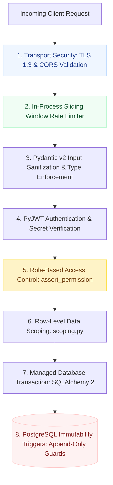
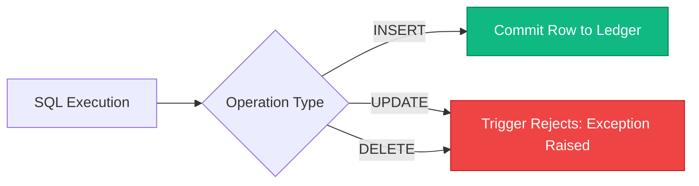

# 🔒 Platform Security Architecture

> **Authentication, Fine-Grained RBAC, Tenant Isolation & Trigger-Enforced Immutability**  
> *Authored by **Crystal Studio Labs** for BPUT Hackathon 2026 — Problem Statement 07 (Fretbox)*

---

## 🧭 Navigation
[Root README](../../README.md) • [Documentation Hub](../README.md) • [Architecture](./architecture.md) • [Data Model](./data-model.md) • [API Specification](../specifications/api.md)

---

Campus Relay employs a zero-trust, defense-in-depth security model. Security controls are enforced exclusively on the server at API and database boundaries. Client-side permission checks are purely a navigational and rendering convenience.

---

## 🛡️ Defense-in-Depth Model

---

## 🔑 Authentication Architecture

- **Password Hashing**: Stored using industry-standard `bcrypt` with automatic salting (`app/core/security.py`). Plaintext passwords never touch logs or persistent storage.
- **Signed Tokens**: Sessions authenticate via RFC 7519 JSON Web Tokens (PyJWT) signed using `HS256` with a configurable lifespan (`ACCESS_TOKEN_EXPIRE_MINUTES`, default 12 hours).
- **Secret Isolation**: Cryptographic signing utilizes `APP_SECRET_KEY` injected exclusively via environment variables. It is never checked into source control.
- **Audit Logging**: Both successful logins and failed attempts emit immutable security events (`AUTH_LOGIN`, `AUTH_FAILED`). Log records capture actor IP and email presence, never credentials.

---

## 👥 Role-Based Access Control (RBAC)

The platform defines eight granular institutional roles in `app/core/permissions.py`:

| Role Identifier | Operational Scope & Capabilities |
| :-- | :-- |
| **`SUPER_ADMIN`** | Institutional tenant governance, system settings, global role definitions. |
| **`ADMIN`** | Full operational command centre, campus-wide queues, SLA sweeps, and audit trails. |
| **`WARDEN`** | Residential hostel oversight, student leave authorizations, and digital gate pass approvals. |
| **`DEPARTMENT_HEAD`** | Departmental ticket management, staff allocation, and workload balancing. |
| **`STAFF`** | Technician execution, task status progression, and work evidence uploads. |
| **`SECURITY`** | Gate desk terminal, pass barcode scanning, anti-passback enforcement, live headcounts. |
| **`HELPDESK_OPERATOR`**| Assisted service desk, student roll number lookups, and proxy case filings. |
| **`STUDENT`** | Personal service requisitions, hostel complaints, and notice acknowledgements. |

> [!IMPORTANT]
> Every single mutating endpoint executes `assert_permission(...)` inside dependency injection. Attempting an unauthorized action triggers an immediate HTTP 403 Forbidden with zero data exposure.

---

## 🔍 Row-Level Data Scoping (`app/services/scoping.py`)

Permission authorizes *actions*; scoping dictates *visibility*:

- **Hostel Wardens**: Queries are filtered strictly to their assigned hostels and blocks.
- **Maintenance Staff**: Technicians only see tickets assigned directly to them or their department queue.
- **Students**: Scoped exclusively to tickets and documents raised under their personal user ID.
- **Gate Security**: Access is scoped to active passes for the current calendar window and immediate gate logs.

> [!NOTE]
> Attempting to read another student's case by guessing its primary key returns an explicit **HTTP 403 Forbidden**, rather than a deceptive empty list.

---

## 🏢 Multi-Tenant Campus Isolation

Every database table representing campus operations contains an indexed `campus_id` foreign key. The backend extracts `campus_id` directly from the authenticated JWT claims and scopes all queries accordingly. A compromised token for College A cannot query or mutate records belonging to College B.

---

## 📜 Audit Integrity & Database Triggers

To prevent any possibility of database tampering, historical log tables are protected by PostgreSQL triggers created in migration `0002_append_only_guards`:
- `audit_logs`
- `case_events`
- `gate_logs`
- `notification_events`

Even an administrator running raw SQL queries cannot rewrite historical event records. Furthermore, SQLAlchemy ORM listeners in `app/models/immutability.py` raise `ImmutableRecordError` as an additional defensive layer.

---

## 🌐 Transport & Privacy Protections

- **Strict CORS Origin Whitelist**: Cross-Origin Resource Sharing is locked down to specific trusted domains configured in `CORS_ORIGINS`.
- **SQL Injection Prevention**: All queries utilize parameterized SQLAlchemy ORM statements; raw string concatenation of user input is prohibited.
- **File Upload Safeguards**: Attachments are validated against strict MIME types and size-capped (`MAX_UPLOAD_BYTES`, default 5MB).
- **Privacy-Preserving Physical QR Codes**: Room and asset QR codes encode solely an opaque identifier (e.g. `CR-ROOM-AA-101`). They never embed student names, roll numbers, or personal details.
- **Zero-Trust Document Verification**: Public verification links (`GET /api/v1/documents/verify/{code}`) validate authenticity and issue timestamp without exposing private academic or financial data.

---

### 📬 Contact & Institutional Support
- **Lead Organization**: **Crystal Studio Labs**
- **Security Vulnerability Reporting**: [`connect.crystalstudio@gmail.com`](mailto:connect.crystalstudio@gmail.com)
- **Competition Track**: BPUT Hackathon 2026 — Problem Statement 07 (Fretbox)
- **Main Repository**: [GitHub: Crystal-Studio-Labs/Campus-Relay](https://github.com/Crystal-Studio-Labs/Campus-Relay)
