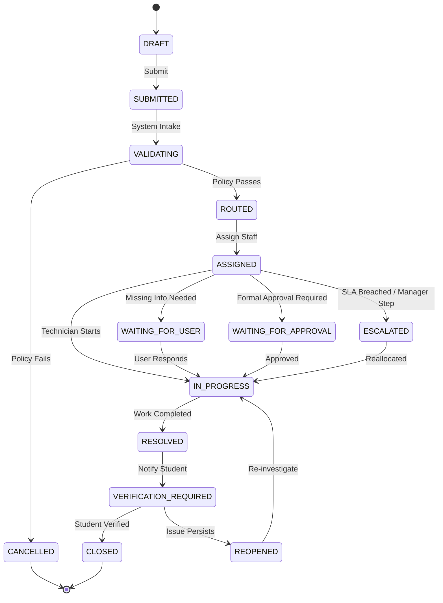
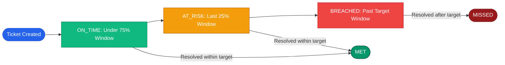
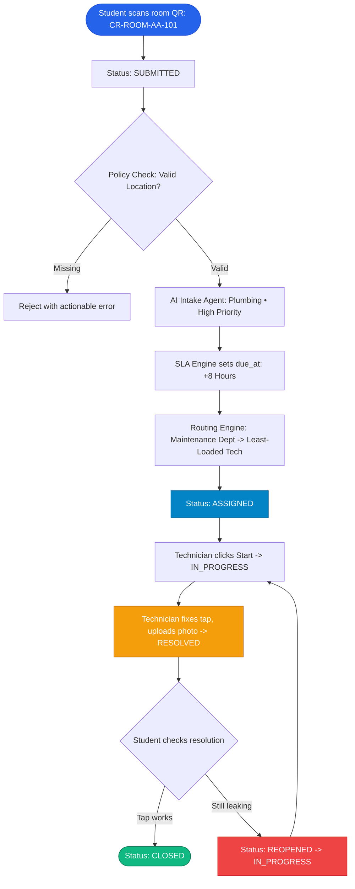

# ⚙️ Workflow, Policy & SLA Engines

> **The Configurable State Machine, Declarative Rules & Service Level Agreements**  
> *Authored by **Crystal Studio Labs** for BPUT Hackathon 2026 — Problem Statement 07 (Fretbox)*

---

## 🧭 Navigation
[Root README](../../README.md) • [Documentation Hub](../README.md) • [Architecture](./architecture.md) • [Data Model](./data-model.md) • [Offline Sync](./offline-sync.md)

---

Campus Relay decouples domain logic into three interoperable engines: the **Workflow Engine**, the **Policy Engine**, and the **SLA Engine**. This modular design transforms the addition of new campus services from a software development task into a declarative configuration exercise.

---

## 🔄 Case State Machine

The case state machine is strictly governed by `app/models/enums.py::CaseStatus` and implemented in `app/services/case_engine.py`. Invalid state transitions are rejected with HTTP 400 at the service layer, guaranteeing that the database can never be coerced into an inconsistent operational state.

### Derived Status Classifications
- **`OPEN_STATUSES`**: Cases actively in flight (`SUBMITTED`, `VALIDATING`, `ROUTED`, `ASSIGNED`, `IN_PROGRESS`, `WAITING_FOR_USER`, `WAITING_FOR_APPROVAL`, `ESCALATED`, `REOPENED`).
- **`PENDING_HUMAN_STATUSES`**: Cases currently blocked on human action (`WAITING_FOR_APPROVAL`, `WAITING_FOR_USER`, `VERIFICATION_REQUIRED`).
- **`CLOSED_STATUSES`**: Terminal states (`CLOSED`, `CANCELLED`).

> [!IMPORTANT]
> **Two Ironclad Behavioral Guarantees:**
> 1. **Requester Verification Guard**: A technician or supervisor cannot unilaterally mark a case permanently closed. The student who raised the ticket must verify the work, with the explicit option to reopen if the defect persists.
> 2. **Immutable Append-Only Audit Trail**: Every single transition emits a `CaseEvent` and `AuditLog` row. Both tables are protected by PostgreSQL triggers that reject all update and delete queries.

---

## 📋 Workflow Engine (`app/services/workflow.py`)

A `Workflow` represents an ordered series of `WorkflowStep` records. Each step declares a distinct `WorkflowStepType`:

| Step Type | Description & Behavior |
| :-- | :-- |
| `APPROVAL` | Pauses progress until authorized by a specific role (Warden, HOD, Registrar). |
| `ASSIGNMENT` | Routes the ticket to a designated department and technician queue. |
| `ACTION` | Requires physical or administrative task execution. |
| `RESOLUTION` | Technician marks the work complete and submits photographic evidence. |
| `VERIFICATION` | The requester inspects and confirms the resolution. |
| `NOTIFICATION` | Triggers targeted in-app and external delivery alerts. |

The workflow engine evaluates: *"Which step is this case currently on, which role is authorized to act next, and what fields are required?"* This state is exposed via `GET /cases/{id}/workflow`, enabling dynamic frontend button rendering without hardcoded business rules on the client.

---

## 🛡️ Policy Engine (`app/services/policy.py`)

The Policy Engine evaluates declarative rule sets against case parameters **prior to routing**. Each clause specifies a `field`, an operator (`op`), and an explanatory `message`.

### Supported Operators
- `required` / `truthy` / `falsy`
- `equals` / `not_equals`
- `gte` / `lte` / `in` / `not_in`

### Production Examples Shipped in Seed:
1. **Hostel Leave Policy**:
   - `leave_start` and `leave_end` must be valid timestamps.
   - `leave_end` must not precede `leave_start`.
   - `leave_start` cannot be in the past.
2. **Bonafide Certificate Policy**:
   - Student academic record must include registered branch and year.
   - Purpose string is mandatory.
   - Student dues balance must be zero; if non-zero, the policy halts generation and dispatches an alert to Accounts.
3. **Digital Gate Pass Policy**:
   - A valid, approved leave record must exist.
   - Anti-passback validation: passes cannot be scanned for duplicate exits without a verified intermediate entry.

> [!TIP]
> Because policy evaluations occur before routing, non-compliant requests fail fast with clear, human-readable explanations (e.g. *"Your academic year is missing in registrar records"*) rather than vague system errors.

---

## ⏱️ SLA Engine (`app/services/sla.py`)

The SLA Engine calculates deterministic due dates (`due_at`) based on the case's assigned `Service` and `Priority`.

### Pre-Configured Demo SLA Windows
| Priority | Target Resolution Time | At-Risk Threshold |
| :-- | :-- | :-- |
| `CRITICAL` | 2 hours | Remaining time < 30 mins |
| `HIGH` | 8 hours | Remaining time < 2 hours |
| `NORMAL` | 24 hours | Remaining time < 6 hours |

- **Automated SLA Sweep**: `POST /admin/sla/sweep` crawls all open cases, calculates elapsed time against targets, and publishes `SLA_AT_RISK` and `SLA_BREACHED` audit events.
- **Time-Travel Testing**: The endpoint `POST /admin/demo/time-travel` advances the demo system clock by N days to facilitate rapid evaluation of SLA alerts during demonstrations.

---

## 📍 Putting It Together: Hostel Maintenance Walkthrough

---

### 📬 Contact & Institutional Support
- **Lead Organization**: **Crystal Studio Labs**
- **Direct Technical Inquiries**: [`connect.crystalstudio@gmail.com`](mailto:connect.crystalstudio@gmail.com)
- **Competition Track**: BPUT Hackathon 2026 — Problem Statement 07 (Fretbox)
- **Main Repository**: [GitHub: Crystal-Studio-Labs/Campus-Relay](https://github.com/Crystal-Studio-Labs/Campus-Relay)
