# 🚀 Production Deployment & Infrastructure Runbook

> **Complete Guide for Split-Cloud (Vercel + Render + Supabase) & On-Premises Docker**  
> *Authored by **Crystal Studio Labs** for BPUT Hackathon 2026 — Problem Statement 07 (Fretbox)*

[](#topological-overview-two-deployment-shapes)
[](#2-single-machine-self-hosted-docker)
[](#1-split-cloud-deployment-vercel--render--supabase)
[](#-contact--institutional-support)

---

## 🧭 Navigation
[Root README](../../README.md) • [Documentation Hub](../README.md) • [Supabase Integration](./SUPABASE.md) • [Setup Guide](../guides/setup-guide.md) • [Configuration](../specifications/CONFIGURATION.md)

---

## 📐 Topological Overview: Two Deployment Shapes

```mermaid
flowchart TD
    subgraph SplitCloud ["Shape 1: Split Cloud (Demo & Fast Evaluation)"]
        SC_Vercel[Vercel: React PWA Edge CDN]
        SC_Render[Render: FastAPI Docker Web Service]
        SC_Supa[(Supabase: Managed PostgreSQL 16 + Pooling)]

        SC_Vercel -- "API Requests (CORS)" --> SC_Render
        SC_Render -- "Session Pooling (5432)" --> SC_Supa
    end

    subgraph SelfHost ["Shape 2: Single-Machine Self-Hosted (On-Premises Air-Gapped)"]
        SH_Proxy[nginx Web Proxy: Port 8080]
        SH_API[FastAPI Backend Container]
        SH_DB[(PostgreSQL 16 Container)]

        SH_Proxy -- "Static PWA Files & Proxy /api" --> SH_API
        SH_API -- "Local Docker Network" --> SH_DB
    end

    style SplitCloud fill:#eff6ff,stroke:#bfdbfe,color:#1e3a8a
    style SelfHost fill:#f0fdf4,stroke:#bbf7d0,color:#14532d
    style SC_Supa fill:#336791,stroke:#1e3a8a,color:#ffffff
    style SH_DB fill:#336791,stroke:#1e3a8a,color:#ffffff
```



| Deployment Feature | Split-Cloud Architecture | Single-Machine Self-Hosted |
| :-- | :-- | :-- |
| **Frontend Surface** | Vercel Edge Global CDN | Built PWA served via local nginx container |
| **Backend Service** | Render Managed Web Service | Local Docker container (`backend`) |
| **Database Engine** | Supabase Managed Cloud Postgres | Local PostgreSQL 16 container volume |
| **Best Suited For** | Evaluation panels, public live demos, distributed access | Strict institutional data residency, on-premises intranet |
| **Network Configuration**| Two origins (`CORS_ORIGINS` + `VITE_API_BASE_URL`) | Single origin (Zero CORS required) |
| **Manifests** | [`render.yaml`](../../render.yaml), `frontend/vercel.json` | `docker-compose.selfhost.yml` |

---

## 1. Split-Cloud Deployment (Vercel + Render + Supabase)

### 1.1 Database Provisioning (Supabase)
1. Create a project at [supabase.com](https://supabase.com).
2. Navigate to **Project Settings → Database → Connection string → URI**.
3. Copy the **Connection pooling** URI (Session mode, port `5432`) and append `?sslmode=require`:
   ```text
   postgresql://postgres.<ref>:<password>@aws-0-<region>.pooler.supabase.com:5432/postgres?sslmode=require
   ```
4. Retain this connection URI for the Render configuration step. You do **not** need to manually create tables — Alembic applies migrations automatically on the first boot.

> [!NOTE]
> The backend automatically normalizes `postgresql://` URIs to `postgresql+psycopg://` at runtime (`app/core/config.py::normalise_database_url`), so you can paste the Supabase string verbatim.

### 1.2 Backend Deployment (Render)
1. Push this repository to your GitHub account.
2. In the Render Dashboard, select **New → Blueprint** and point it at the repository. Render reads [`render.yaml`](../../render.yaml) and creates the `campus-relay-api` service.
3. Supply required environment variables:
   - `DATABASE_URL`: The pooled Supabase URI from Step 1.1.
   - `CORS_ORIGINS`: Your Vercel frontend domain (e.g. `https://campus-relay.vercel.app`).
4. Click **Deploy**. Alembic runs database migrations automatically (`alembic upgrade head`).
5. Seed initial realistic campus records from the Render Shell:
   ```bash
   python -m app.seed.seed_data
   ```

### 1.3 Frontend Deployment (Vercel)
1. In Vercel, select **Add New → Project** and import the repository.
2. Set **Root Directory** to `frontend`.
3. Add the following production environment variable:
   - `VITE_API_BASE_URL`: Your live Render API URL (e.g. `https://campus-relay-api.onrender.com`).
4. Click **Deploy**. Ensure the final Vercel URL is added back to Render's `CORS_ORIGINS`.

---

## 2. Single-Machine Self-Hosted (Docker Compose)

For universities requiring complete on-premises data residency on local university servers:

```bash
# Clone the repository
git clone https://github.com/Crystal-Studio-Labs/Campus-Relay.git
cd Campus-Relay

# Generate local environment secrets
cp .env.example .env

# Launch database, backend API, and web interface
docker compose -f docker-compose.selfhost.yml up -d --build
```

Access the application at `http://<server-ip>:8080`.

### Container Startup Orchestration
1. The `db` container initializes PostgreSQL 16 and performs health checks.
2. The `backend` container waits for database readiness, applies `alembic upgrade head`, runs `scripts/bootstrap.py` (which seeds demo data **only if the database is unpopulated**), and starts FastAPI.
3. The `web` container serves the PWA assets and proxies `/api` requests internally to the backend.

### Operational Commands
```bash
# View real-time container logs
docker compose -f docker-compose.selfhost.yml logs -f backend

# Gracefully stop containers (preserves database volumes)
docker compose -f docker-compose.selfhost.yml down

# Rebuild containers following a git pull update
docker compose -f docker-compose.selfhost.yml up -d --build
```

---

## 3. Environment Configuration Matrix

| Variable | Split-Cloud Mode | Self-Hosted Single Machine | Description |
| :-- | :-- | :-- | :-- |
| `DATABASE_URL` | Pooled Supabase URI | Generated internally from `POSTGRES_*` | Active PostgreSQL connection string. |
| `CORS_ORIGINS` | Vercel domain URL | Unset / empty (Single origin proxy) | Whitelist for cross-origin browser requests. |
| `VITE_API_BASE_URL` | Render API origin | Empty (Nginx proxies `/api`) | Client API target address. |
| `APP_ENV` | `demo` | `production` (once deployed live) | Governs demo reset endpoints and credentials. |
| `WEB_PORT` | N/A | `8080` | Local port exposed by the reverse proxy. |
| `PUBLIC_BASE_URL` | Render API domain | Machine public IP or reverse proxy URL | Origin used by Telegram/WhatsApp to fetch media. |
| `DELIVERY_WORKER_ENABLED`| `true` | `true` | Runs asynchronous notification outbox worker. |

---

### 📬 Contact & Institutional Support
- **Lead Organization**: **Crystal Studio Labs**
- **DevOps & Infrastructure Inquiries**: [`connect.crystalstudio@gmail.com`](mailto:connect.crystalstudio@gmail.com)
- **Competition Track**: BPUT Hackathon 2026 — Problem Statement 07 (Fretbox)
- **Main Repository**: [GitHub: Crystal-Studio-Labs/Campus-Relay](https://github.com/Crystal-Studio-Labs/Campus-Relay)
