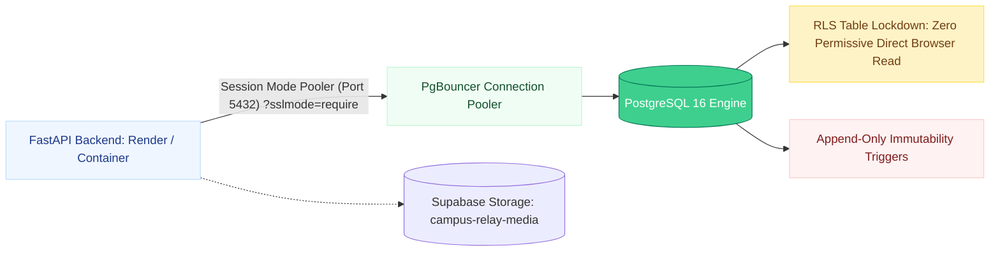

# ⚡ Supabase Managed Cloud Postgres Integration

> **Managed PostgreSQL 16 Provisioning, Connection Pooling & Row-Level Security**  
> *Authored by **Crystal Studio Labs** for BPUT Hackathon 2026 — Problem Statement 07 (Fretbox)*

[](https://supabase.com)
[](#1-create-and-configure-the-project)
[](#security-model--row-level-security)
[](#-contact--institutional-support)

---

## 🧭 Navigation
[Root README](../../README.md) • [Documentation Hub](../README.md) • [Deployment Guide](./DEPLOYMENT.md) • [Data Model](../architecture/data-model.md) • [Security](../architecture/security.md)

---

Campus Relay operates on standard PostgreSQL 16. **Supabase** offers an excellent cloud hosting choice for evaluation deployments, providing managed automated backups, built-in connection pooling, a private storage bucket, and a visual SQL editor.

---

## 🏛️ Supabase Cloud Topology



---

## 1. Create and Configure the Project

1. Sign in to [supabase.com](https://supabase.com) and create a new project. Choose an AWS region closest to your campus and save your database password.
2. In **Project Settings → Database**, navigate to **Connection string → URI**.
3. Select the **Connection pooling** tab (Port `5432` or `6543`, Session mode) and copy the URI with `?sslmode=require`:
   ```text
   postgresql://postgres.<project-ref>:<password>@aws-0-<region>.pooler.supabase.com:5432/postgres?sslmode=require
   ```

> [!TIP]
> The backend automatically converts `postgres://` or `postgresql://` to `postgresql+psycopg://` at runtime (`app/core/config.py::normalise_database_url`), so you can supply the string exactly as generated by Supabase.

---

## 2. Apply Database Schema

Choose one of two verified approaches:

### Option A: Execute the Generated Schema (Recommended for Fresh Projects)
Open **Supabase Dashboard → SQL Editor → New query**, paste the entire contents of [`supabase/schema.sql`](../../supabase/schema.sql), and click **Run**.
This automatically creates:
- All 42 relational tables, check constraints, foreign keys, and indexes.
- The append-only immutability trigger function and its four table triggers.
- Row-Level Security (RLS) enabled across every table with zero public leak.
- The private `campus-relay-media` storage bucket.

> [!NOTE]
> The schema file is programmatically exported directly from the SQLAlchemy ORM models:
> ```bash
> cd backend
> python -m scripts.export_supabase_schema
> ```

### Option B: Alembic Automatic Migration
```bash
cd backend
alembic upgrade head
```
This executes migrations sequentially. If choosing Option B, manually execute the storage bucket creation lines from `supabase/schema.sql` to configure file upload storage.

---

## 3. Configure the Backend API

Configure environment variables in your deployment host (Render dashboard or local `.env`):

```ini
DATABASE_URL=postgresql://postgres.<ref>:<password>@aws-0-<region>.pooler.supabase.com:5432/postgres?sslmode=require
DB_POOL_SIZE=5
DB_MAX_OVERFLOW=5
APP_ENV=production
APP_SECRET_KEY=your-secure-32-character-random-secret
CORS_ORIGINS=https://campus-relay.vercel.app
```

Populate the initial campus dataset:
```bash
cd backend
python -m app.seed.seed_data
```

---

## 🔒 Security Model & Row-Level Security

> [!IMPORTANT]
> The FastAPI backend owns 100% of data access and business logic. The browser never makes direct PostgREST calls to Supabase.

| Security Layer | Setting | Architectural Rationale |
| :-- | :-- | :-- |
| **Row-Level Security** | **Enabled on all 42 tables**; zero permissive anonymous policies. | Defense-in-depth: even if your `anon` public key is exposed, no data can be queried. |
| **API Connection** | Dedicated Postgres role via `DATABASE_URL`. | Bypasses RLS to execute authorized domain queries; API enforces row-level data scoping. |
| **Storage Bucket** | `campus-relay-media`: **Private**. | Attachments are streamed through API endpoints that verify caller authentication. |

---

## 🛠️ Supabase Troubleshooting Matrix

| Symptom | Probable Cause | Verification & Remediation |
| :-- | :-- | :-- |
| **`HTTP 503 database_unavailable`** | Connection string malformed or connection pool exhausted. | Confirm port `5432` pooling URI; lower `DB_POOL_SIZE` in `.env`. |
| **`SSL connection is required`** | Missing SSL mode query parameter. | Ensure `?sslmode=require` is appended to the connection string. |
| **Migration reports "already exists"** | Schema applied via both Alembic and `schema.sql`. | Execute `alembic stamp head` to align version tracking without re-running DDL. |
| **Attachment images 404** | `MEDIA_ROOT` stored on ephemeral container disk. | Configure persistent storage or mount Supabase Storage bucket. |
| **Telegram / WhatsApp not sending** | Adapter credentials unconfigured (by design). | Set `TELEGRAM_BOT_TOKEN` in `.env`; check status via `GET /api/v1/meta`. |

---

### 📬 Contact & Institutional Support
- **Lead Organization**: **Crystal Studio Labs**
- **Cloud Database Support**: [`connect.crystalstudio@gmail.com`](mailto:connect.crystalstudio@gmail.com)
- **Competition Track**: BPUT Hackathon 2026 — Problem Statement 07 (Fretbox)
- **Main Repository**: [GitHub: Crystal-Studio-Labs/Campus-Relay](https://github.com/Crystal-Studio-Labs/Campus-Relay)
