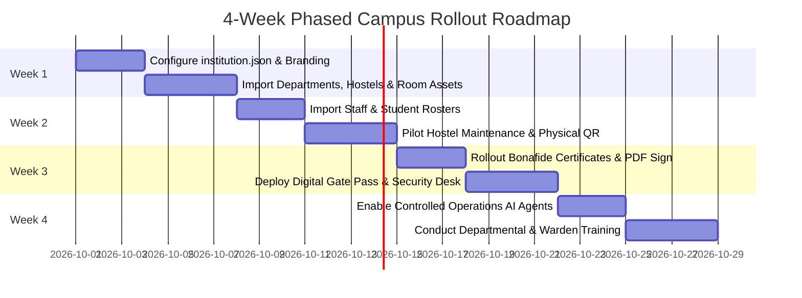
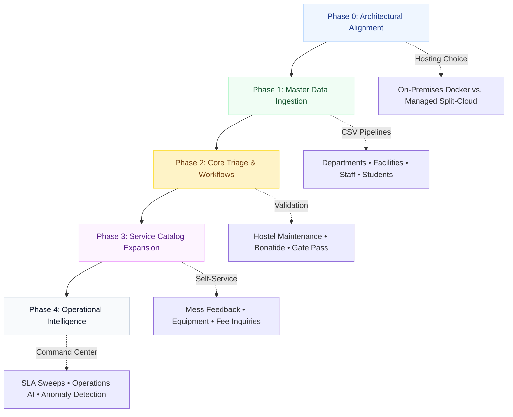

# 🗺️ Institutional Adoption & Migration Roadmap

> **A Strategic 4-Week Rollout Plan for Universities and Colleges**  
> *Authored by **Crystal Studio Labs** for BPUT Hackathon 2026 — Problem Statement 07 (Fretbox)*

---

## 🧭 Navigation
[Root README](../../README.md) • [Documentation Hub](../README.md) • [Setup Guide](./setup-guide.md) • [Competitive Gap](./competitive-gap.md) • [Demo Script](./demo-script.md)

---

Campus Relay is architected to eliminate the friction typically associated with enterprise software replacements. A university adopts Campus Relay not by rewriting code or retraining entire IT departments, but by configuring declarative policies and executing validated CSV imports.

---

## 📅 Four-Week Indicative Timetable

---

## 🎯 Phased Adoption Strategy

---

### Phase 0: Architectural & Infrastructure Alignment

Before ingesting data, institutional administrators address three primary questions:
1. **Hosting Topology**: Will the campus run an on-premises, air-gapped single server (via `docker-compose.selfhost.yml`) or a managed split-cloud deployment (Render + Vercel + Supabase)?
2. **First Responders**: Which department is the operational pilot? *(Recommended: Hostel Maintenance & Estate Management).*
3. **Pilot Workflows**: Launch with the three highest-volume campus workflows: Hostel Complaints, Bonafide Certificates, and Hostel Leave Gate Passes.

---

### Phase 1: Data Ingestion & Sanitization

Migration relies on structured, dry-run-validated CSV imports. The ingestion sequence is strictly ordered to respect relational foreign key dependencies:

1. `departments.csv` → Administrative divisions
2. `branches.csv` → Academic faculties
3. `hostels.csv` → Residential halls and blocks
4. `rooms.csv` → Student dorms and laboratory spaces
5. `locations.csv` → Physical QR code coordinate targets
6. `assets.csv` → Tracked physical fixtures (fans, air conditioners, water coolers)
7. `staff.csv` → Technicians, wardens, and department heads
8. `students.csv` → Roll numbers, active room allocations, and fee dues status
9. `services.csv` → Configurable service catalog entries
10. `historical_cases.csv` *(Optional)* → Closed legacy tickets to preserve historical resolution analytics

> [!IMPORTANT]
> Historical cases retain their original creation and resolution timestamps, ensuring that SLA ageing and resolution efficiency charts are immediately accurate and meaningful from Day 1.

---

### Phase 2: Core Operational Verification

The institution tests and signs off on the primary operational loops:
- **Hostel Maintenance**: A student scans a physical room QR code, the ticket auto-routes to Maintenance, a technician resolves it with photographic proof, and the student verifies completion.
- **Verifiable Certificate**: A student requests a Bonafide Certificate, the registrar approves it, and ReportLab generates a verifiable PDF containing an immutable QR code and serial number.
- **Leave & Gate Security**: A warden approves a weekend leave request, the student receives a digital gate pass, security scans it at the gate desk (enforcing anti-passback controls), and the ticket auto-closes upon return.

---

### Phase 3: Service Catalog Expansion

With core operational infrastructure proven, institutions introduce secondary self-service items purely via database configuration (`services.csv`):
- Mess food quality complaints & menu feedback.
- Sports equipment requisition.
- Fee clearance and accounts queries.
- Academic marksheet issuance and transcript verification.
- Campus lost-and-found tracking.

---

### Phase 4: Operational Intelligence & Automation

1. **Activate the Operations Agent**: Crawl active tickets to surface recurring equipment defects and staff workload concentration.
2. **Tune SLA Targets**: Adjust default 24h/8h/2h thresholds to institutional service level agreements.
3. **Enable Messaging Adapters**: Connect Telegram Bot API or Meta WhatsApp Cloud API credentials in `.env` to enable multi-channel circular dispatches.

---

## 🔒 Data Ownership & Sovereignty

- **Absolute Ownership**: The university owns 100% of the PostgreSQL database, audit logs, and document assets.
- **Zero Proprietary Lock-In**: All records can be exported at any time into standard JSON or CSV formats via the Admin Command Centre (`/admin/data/export`).
- **Air-Gapped Operation**: On-premises installations do not transmit telemetry or user records to external cloud endpoints.

---

## 🔄 Rollback & Recovery Strategy

- **Additive Schema Migrations**: All Alembic migrations are backward-compatible. In production, redeploying containers executes non-destructive upgrades (`alembic upgrade head`).
- **Seed Guardrails**: Production containers execute `backend/scripts/bootstrap.py`, which only seeds sample data if the database is completely empty. Active institutional databases are never overwritten.
- **Point-in-Time Database Snapshots**: Standard PostgreSQL pg_dump backups allow instantaneous restoration to any prior operational state.

---

### 📬 Contact & Institutional Support
- **Lead Organization**: **Crystal Studio Labs**
- **Migration & Rollout Consultation**: [`connect.crystalstudio@gmail.com`](mailto:connect.crystalstudio@gmail.com)
- **Competition Track**: BPUT Hackathon 2026 — Problem Statement 07 (Fretbox)
- **Main Repository**: [GitHub: Crystal-Studio-Labs/Campus-Relay](https://github.com/Crystal-Studio-Labs/Campus-Relay)
