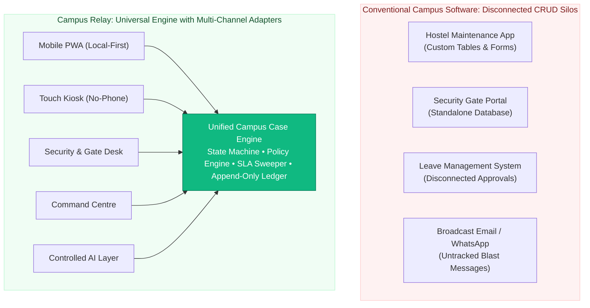

# ⚖️ Competitive Reality & Architectural Gap Analysis

> **A Rigorous Technical Comparison: Universal Engine vs. Departmental CRUD Silos**  
> *Authored by **Crystal Studio Labs** for BPUT Hackathon 2026 — Problem Statement 07 (Fretbox)*

---

## 🧭 Navigation
[Root README](../../README.md) • [Documentation Hub](../README.md) • [Requirements](./requirements.md) • [Architecture](../architecture/architecture.md) • [Adoption Plan](./adoption-plan.md)

---

## ⚖️ Deliberately Honest Framing

This document is deliberately grounded, factual, and conservative. It does **not** claim Campus Relay is an unprecedented invention, nor does it disparage commercial market incumbents like Fretbox. Commercial campus management tools have real, demonstrated capabilities.

The primary thesis presented here is architectural: **Campus Relay is engineered as a unified, configurable operational operating system rather than a collection of disconnected department-specific CRUD forms.**

---

## 📋 Problem Statement 07 Context

BPUT Problem Statement 07 (Fretbox) identifies the core structural pathologies plaguing modern university campuses:
- **Fragmentation**: Hostels manage maintenance via paper logbooks; student councils broadcast notices on unmoderated WhatsApp groups; security guards inspect handwritten gate registers.
- **Opacity**: Registrars and deans have no real-time visibility into ticket ageing, SLA breaches, or recurring equipment failure clusters.
- **Exclusion**: Students in connectivity-deprived hostel basements or those without high-end smartphones are disenfranchised from institutional workflows.

---

## 🔍 Where Capabilities Overlap (Table Stakes)

Both conventional campus software and Campus Relay support essential administrative functions:
- Digital complaint submission and status tracking.
- Notice and broadcast publishing.
- Student leave requests and warden approvals.
- Administrative reporting and basic charts.

> [!NOTE]
> Feature overlap is natural and expected. The true divergence lies in **how the software behaves under real-world operational stress** (offline dead zones, audit disputes, cross-department scaling).

---

## 🏛️ The Structural Divergence

---

## 📊 Detailed Architectural Differentiation

| Architectural Dimension | Conventional Campus CRUD Tools | Campus Relay Operational Layer |
| :--- | :--- | :--- |
| **Service Extensibility** | Writing new database tables, API routes, and frontend views for every new campus department. | **Declarative Service Configuration**: Define catalogue entries, workflow steps, and policy rules in JSON/CSV. |
| **Request Abstraction** | Disconnected data models (`HostelComplaint`, `BonafideRequest`, `SportsRequisition`). | **Universal `CampusCase`**: One shared state machine, unified event stream, and standard SLA engine. |
| **Offline Resilience** | Read-only browser caching; submitting a form offline results in an immediate network failure error. | **Local-First PWA**: IndexedDB persistent outbox with client-generated idempotency keys and automatic conflict reconciliation. |
| **Audit Integrity** | Mutable database rows easily modified via database clients or administrative overrides. | **Trigger-Enforced Immutability**: PostgreSQL triggers reject all `UPDATE` and `DELETE` queries on event tables. |
| **Accessibility Equity** | Typically requires a modern smartphone with high-speed internet connectivity. | **Channel-Independent Fallbacks**: Touch-first Kiosk Mode with roll-number lookup and assisted Helpdesk proxy filing. |
| **Document Security** | Static downloadable PDFs vulnerable to digital tampering or photo manipulation. | **Verifiable PDF Engine**: Cryptographically signed serials with public zero-trust QR validation endpoints. |
| **Intelligence Integration** | Ungrounded, hallucination-prone conversational chatbots with raw database access. | **Controlled Tool-Sandboxed AI**: 4 specialized operational agents operating behind strict RBAC, data scoping, and policy boundaries. |

---

## 💡 Why Campus Relay is More Than Another CRUD App

1. **The Engine is the Product**: Campus services are data, not code. The same state machine, policy validator, and SLA sweep engine power hostel repairs, leave passes, and certificate requisitions.
2. **Offline Resilience is Demonstrated, Not Asserted**: The IndexedDB client outbox, deterministic retry backoff, and idempotent server deduplication operate flawlessly in simulated airplane-mode conditions.
3. **Provable, Tamper-Evident History**: Because immutability is guaranteed by PostgreSQL database triggers, the audit trail cannot be forged or erased by future software updates.
4. **Equal Citizenship Across Access Channels**: A complaint filed from a touch kiosk or assisted desk enters the identical queue as one filed from an iPhone.
5. **Deterministic Intelligence with Safe Fallback**: When an external LLM provider encounters network timeouts, the system automatically falls back to local deterministic rule engines with zero downtime.

---

## 🛡️ Explicit Non-Claims & Ethical Commitments

- We make no speculative assertions regarding features Fretbox may or may not introduce in future releases.
- We present no fabricated performance, adoption, or user satisfaction statistics.
- External messaging integrations (Telegram and WhatsApp) are implemented as real adapters; when credentials are not configured, they honestly report as **unconfigured** rather than fabricating delivery confirmation.

---

### 📬 Contact & Institutional Support
- **Lead Organization**: **Crystal Studio Labs**
- **Architecture & System Inquiry**: [`connect.crystalstudio@gmail.com`](mailto:connect.crystalstudio@gmail.com)
- **Competition Track**: BPUT Hackathon 2026 — Problem Statement 07 (Fretbox)
- **Main Repository**: [GitHub: Crystal-Studio-Labs/Campus-Relay](https://github.com/Crystal-Studio-Labs/Campus-Relay)
