# 🎭 Master Demo Script & Presentation Runbook

> **A Reproducible 12-Minute Live Pitch & Evaluation Walkthrough**  
> *Authored by **Crystal Studio Labs** for BPUT Hackathon 2026 — Problem Statement 07 (Fretbox)*

[](#presentation-timeline-flowchart)
[](#pre-demo-preparation-checklist)
[](#resetting-state-between-jury-rounds)
[](#-contact--institutional-support)

---

## 🧭 Navigation
[Root README](../../README.md) • [Documentation Hub](../README.md) • [Competitive Gap](./competitive-gap.md) • [Requirements](./requirements.md) • [Setup Guide](./setup-guide.md)

---

This script provides a structured, time-calibrated demonstration sequence designed for evaluation panels, jury rounds, or institutional stakeholders.

> [!NOTE]
> All pre-configured demonstration accounts utilize the shared master password: **`Campus@2026`**

---

## ⏱️ Presentation Timeline Flowchart

```mermaid
flowchart TD
    S1["1. The Problem Statement (30s)<br/><i>Campus fragmentation, paper registers, WhatsApp noise</i>"]
    S2["2. Student Files Complaint (2 min)<br/><i>QR scan (CR-ROOM-AA-101), photo upload, ticket reference</i>"]
    S3["3. AI Classification & Routing (1 min)<br/><i>Intake urgency, SLA target set, technician dispatch</i>"]
    S4["4. Staff Resolution & Proof (1.5 min)<br/><i>Technician starts work, uploads fix evidence, marks resolved</i>"]
    S5["5. Requester Verification Guard (1 min)<br/><i>Student verifies resolution or triggers reopen loop</i>"]
    S6["6. Admin Command Centre (1.5 min)<br/><i>Live SLA sweep, ageing buckets, recurring issues tab</i>"]
    S7["7. Targeted Notice Studio (2 min)<br/><i>Target Year 3 CSE, attach circular, live read/ack tracking</i>"]
    S8["8. Offline Local-First Sync (2 min)<br/><i>Simulate Wi-Fi cut, file ticket, reload, restore & sync</i>"]
    S9["9. Verifiable Certificate & QR (1 min)<br/><i>Issue bonafide, download PDF, public scan verification</i>"]
    S10["10. Gate Security & Anti-Passback (1.5 min)<br/><i>Warden approves, security desk scan, duplicate exit blocked</i>"]
    S11["11. Touch Kiosk Station (1 min)<br/><i>No-smartphone fallback, roll number lookup, PIN login</i>"]
    S12["12. Institutional Honesty (30s)<br/><i>Show configured vs. unconfigured adapter channels</i>"]

    S1 --> S2 --> S3 --> S4 --> S5 --> S6 --> S7 --> S8 --> S9 --> S10 --> S11 --> S12

    style S1 fill:#eff6ff,stroke:#bfdbfe,color:#1e3a8a
    style S5 fill:#fef2f2,stroke:#fecaca,color:#7f1d1d
    style S8 fill:#fef3c7,stroke:#fde047,color:#713f12
    style S10 fill:#f0fdf4,stroke:#bbf7d0,color:#14532d
    style S12 fill:#f8fafc,stroke:#cbd5e1,color:#0f172a
```



---

## 🛠️ Pre-Demo Preparation Checklist

Execute this sequence 10 minutes before the presentation begins:

```bash
# Ensure database container is up
docker compose up -d db

# Apply schema migrations and seed warm 30-day realistic campus data
cd backend
alembic upgrade head
python -m app.seed.seed_data

# Start backend API (port 8000) and frontend PWA (port 5173)
# (Or simply run .\run.bat from project root)
```

1. Open **Tab 1**: Landing page (`http://localhost:5173`)
2. Open **Tab 2**: Admin Command Centre (`http://localhost:5173/admin`) logged in as `admin@campusrelay.demo`
3. Open **Tab 3**: Student Portal logged in as `student@campusrelay.demo`
4. Open **Tab 4**: Security Desk logged in as `security@campusrelay.demo`

---

## 🎤 Step-by-Step Presentation Cues

### Act 1: The Fragmentation Crisis & Incident Reporting (2.5 mins)
- **Speaker Pitch**: *"Colleges today run on WhatsApp groups, physical registers, and paper slips. When a hostel washroom leaks, it takes 9 days to fix. Campus Relay unifies all operations into a single resilient engine."*
- **Action**: In the Student Portal, click **Report Issue**.
- **Action**: Scan the physical QR code or enter location code `CR-ROOM-AA-101`.
- **Action**: Enter description: *"Water tap in washroom has been leaking for nine days."*
- **Action**: Click **Submit**. Highlight the immediate reference ID (`CR-CASE-...`) and the append-only audit event.

### Act 2: Automated Triage & Technician Resolution (2.5 mins)
- **Action**: Switch to the Case Detail view. Point out the intelligence logs:
  - **Category**: `PLUMBING` (inferred by Intake Agent).
  - **Priority**: `HIGH` (calculated based on duration and location).
  - **SLA Target**: Deterministic due date (+8 hours).
  - **Routing**: Auto-assigned to Maintenance Department → Senior Plumber.
- **Action**: Log in as `technician@campusrelay.demo`. Open **Assigned Tasks**.
- **Action**: Click **Start Work** (`IN_PROGRESS`), attach completion photo evidence, and click **Resolve**.

### Act 3: Requester Verification & Admin Command Centre (2.5 mins)
- **Speaker Pitch**: *"Unlike legacy software where staff unilaterally mark tickets closed to fake SLA statistics, Campus Relay enforces the Requester Verification Guard."*
- **Action**: Switch back to Student view. The ticket shows `VERIFICATION_REQUIRED`.
- **Action**: Demonstrate that the student can either confirm resolution (`CLOSED`) or click **Reopen Issue** if the repair failed.
- **Action**: Switch to Admin Command Centre (`admin@campusrelay.demo`).
- **Action**: Showcase real-time operational metrics: Open Cases, Ageing Buckets (<24h, 1-3d, 3-7d, >7d), Recurring Fault Clusters, and Departmental Workload.

### Act 4: The Showstopper — Zero-Network Offline Sync (2 mins)
- **Speaker Pitch**: *"Hostels and basements frequently lose internet connectivity. Watch what happens when connectivity dies completely."*
- **Action**: In Student browser session, press `F12`, open the **Network** tab, and toggle **Offline** (or disconnect Wi-Fi).
- **Action**: Submit another maintenance ticket.
- **Action**: Highlight that the submission is **accepted immediately**, stored in IndexedDB, assigned an offline idempotency key, and tagged with an amber "Pending Sync" badge.
- **Action**: Reload the browser page completely — prove the ticket is still there!
- **Action**: Toggle **Offline** back to **Online**.
- **Action**: The connectivity banner flashes green as the background sync worker drains the outbox to `/api/v1/sync/push`.
- **Action**: Switch to Admin screen: exactly **one** case has been created with a verified `SYNCED` audit timestamp.

### Act 5: Zero-Trust Certificates & Gate Security (2 mins)
- **Action**: As student, request a **Bonafide Certificate**.
- **Action**: Admin approves from the queue. ReportLab generates a verifiable PDF.
- **Action**: Open the PDF and scan the QR code using a smartphone. Demonstrates that the public endpoint (`/api/v1/documents/verify/{code}`) verifies authenticity without revealing student PII.
- **Action**: Student requests weekend leave. Warden approves → Digital Gate Pass issued.
- **Action**: Switch to Security Guard terminal (`security@campusrelay.demo`).
- **Action**: Security scans pass and records **EXIT**. Attempt to scan EXIT a second time — the system rejects it immediately with **Anti-Passback Violation**.
- **Action**: Record **ENTRY** upon student return; the leave ticket automatically marks itself closed.

### Act 6: Kiosk Station & Architectural Honesty (1 min)
- **Action**: Navigate to `/kiosk`. Demonstrate touch-first accessibility for students without smartphones.
- **Action**: Enter student Roll Number (`CS2026-001`), verify PIN, file complaint.
- **Action**: Conclude on `/meta` showing transparency: Telegram is active, while unconfigured SMS/Email adapters honestly report as unconfigured.

---

## 🔄 Resetting State Between Jury Rounds

To completely wipe test records and restore a clean 30-day demonstration dataset:

```bash
# Option A: From terminal
cd backend
python -m app.seed.seed_data

# Option B: From browser
# In Admin Profile -> Click "Rebuild Demo Data"
```

---

## 🛠️ Rapid Presentation Troubleshooting

| Symptom During Pitch | Immediate Fix |
| :-- | :-- |
| **Command Centre shows zero records** | Run `python -m app.seed.seed_data` in backend terminal. |
| **Login fails with network error** | Verify backend FastAPI server is listening on `http://127.0.0.1:8000`. |
| **Offline queue not activating** | Ensure browser is not in hardened private browsing mode where IndexedDB is blocked. |
| **Port 8000 or 5173 already occupied** | Run `.\stop.bat` from project root to kill stale Python/Node background processes. |

---

### 📬 Contact & Institutional Support
- **Lead Organization**: **Crystal Studio Labs**
- **Live Demo Inquiries**: [`connect.crystalstudio@gmail.com`](mailto:connect.crystalstudio@gmail.com)
- **Competition Track**: BPUT Hackathon 2026 — Problem Statement 07 (Fretbox)
- **Main Repository**: [GitHub: Crystal-Studio-Labs/Campus-Relay](https://github.com/Crystal-Studio-Labs/Campus-Relay)
