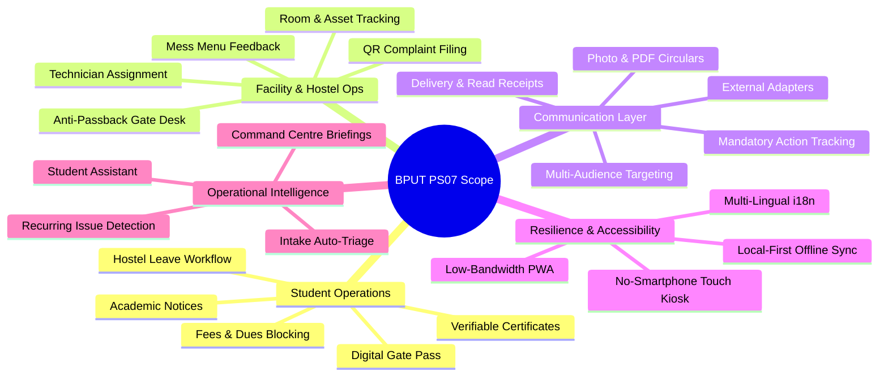

# 📋 Requirements Traceability Matrix

> **Direct Mapping of BPUT Hackathon Problem Statement 07 (Fretbox) to Implementation & Verification**  
> *Authored by **Crystal Studio Labs** for BPUT Hackathon 2026 — Problem Statement 07 (Fretbox)*

---

## 🧭 Navigation
[Root README](../../README.md) • [Documentation Hub](../README.md) • [Setup Guide](./setup-guide.md) • [Competitive Gap](./competitive-gap.md) • [Demo Script](./demo-script.md)

---

This document establishes rigorous bidirectional traceability between the specifications outlined in BPUT Hackathon 2026 Problem Statement 07 (Fretbox), their exact codebase implementation, and the automated commands used to verify correctness.

---

## 🗺️ Requirements Traceability Map

---

## 1. Student Operations Domain

| PS07 Requirement | Codebase Implementation | Verification Method & Test Case |
| :-- | :-- | :-- |
| **Student Leave Requests** | `LEAVE_REQUEST` service in `services/case_engine.py`, warden approval queue in `services/workflow.py`. | Automated in `backend/scripts/e2e_demo.py` (Step: Leave Workflow). |
| **Digital Gate Pass** | `gate_passes` table, HMAC token generation in `services/gate.py`. | Automated in `e2e_demo.py` (Step: Leave to Pass Generation). |
| **Verifiable Documents** | ReportLab PDF generator with cryptographic serial and QR in `services/documents.py`. | Automated in `e2e_demo.py` (Step: Certificate Generation & Byte Verification). |
| **Fee Dues Validation** | Student `dues_balance` checked against policy rule in `services/policy.py`. | Verified via Student Profile screen and policy rejection unit tests. |
| **Academic Timetable Alerts**| Targeted notice categories (`TIMETABLE`) and Student Assistant intent matchers. | Assistant tool test: `POST /api/v1/agents/assistant/ask` with query *"timetable"*. |

---

## 2. Hostel & Facility Operations Domain

| PS07 Requirement | Codebase Implementation | Verification Method & Test Case |
| :-- | :-- | :-- |
| **Maintenance Complaints** | Universal `CampusCase` model, intake categorization, priority heuristics. | Automated in `e2e_demo.py` (Step: Hostel Maintenance Lifecycle). |
| **Lifecycle Tracking** | Formal state machine in `services/case_engine.py` (`SUBMITTED` → `CLOSED`). | Case detail timeline view & `GET /api/v1/cases/{id}`. |
| **Room Master Records** | Hierarchical schema: `hostels` → `blocks` → `rooms` in `models/org.py`. | Directory view under **Places & Assets** in Admin portal. |
| **Asset Maintenance History** | `assets` table with operational linking in `models/org.py`. | Admin Command Centre recurring issues inspector. |
| **Mess Feedback & Food Complaints** | `MESS_COMPLAINT` service entry with dedicated kitchen queue. | Service catalog selection test in Student Portal. |
| **Security Gate Entry/Exit Logs**| `gate_logs` append-only table enforcing anti-passback rules. | Automated in `e2e_demo.py` (Step: Anti-Passback Duplicate Exit Rejection). |

---

## 3. Communication & Broadcast Layer

| PS07 Requirement | Codebase Implementation | Verification Method & Test Case |
| :-- | :-- | :-- |
| **Multi-Audience Targeting** | `notice_targets` supporting 9 dimensions (Campus, Dept, Branch, Year, Hostel, etc.). | Notice Studio audience calculator preview. |
| **Batch / Branch Filtering** | Declarative SQL queries filtering `notice_recipients` by cohort. | Automated in `e2e_demo.py` (Step: Multi-Target Dispatch). |
| **Delivery & Read Tracking** | Recipient state machine in `models/comms.py` (`SENT` → `DELIVERED` → `READ`). | Notice Studio real-time metrics dashboard. |
| **Mandatory Action Tracking** | `notice_actions` tracking acknowledgement checkboxes and link clicks. | Automated in `e2e_demo.py` (Step: Action Acknowledgement). |
| **Circular Photo/PDF Upload** | Direct file attachment support in `POST /api/v1/notices/{id}/attachment`. | Notice Studio circular attachment upload & student preview. |
| **External Messaging** | Asynchronous outbox worker and adapters in `services/delivery.py`. | Notification channel status panel at `/api/v1/meta`. |

---

## 4. Administrative Oversight & Insights

| PS07 Requirement | Codebase Implementation | Verification Method & Test Case |
| :-- | :-- | :-- |
| **Pending Approvals Queue** | Aggregated view via `GET /api/v1/cases/approvals`. | Admin and Warden Command Centre task widgets. |
| **Ticket Ageing Buckets** | SQL interval grouping: `<24h`, `1-3d`, `3-7d`, `>7d` in `api/v1/admin.py`. | Command Centre Ageing distribution chart. |
| **Resolution Time Metrics** | Mean and median time-to-resolve metrics in `/api/v1/admin/resolution-times`. | Command Centre Performance tab. |
| **Recurring Issue Detection** | Multi-case clustering by location, asset, and category over 30 days. | Automated in `e2e_demo.py` (Step: Recurring Issue Clustering). |
| **Technician Workload Balancing** | Active tickets tracked per staff member in `services/routing.py`. | Admin Command Centre Staff Workload Heatmap. |

---

## 5. Resilience & Equitable Accessibility

| PS07 Requirement | Codebase Implementation | Verification Method & Test Case |
| :-- | :-- | :-- |
| **Offline Operation** | Local-First IndexedDB outbox with client idempotency in `frontend/src/lib/idb.ts`. | Mandatory offline simulated disconnection test. |
| **Low-End Hardware Optimization**| Lightweight bundle splitting, reduced motion CSS, pure CSS design tokens. | Production build validation (`npm run build`). |
| **Regional Language Support** | Native internationalization framework (`lib/i18n.ts`) supporting English, Odia, Hindi. | Language toggle in Student Profile and Kiosk header. |
| **Students Without Smartphones** | Physical touch Kiosk Station (`/kiosk`) and assisted Helpdesk desk. | Automated in `e2e_demo.py` (Step: Kiosk Anonymous Roll Lookup). |

---

## 6. Controlled Intelligence Subsystems

| Subsystem | Architectural Role | Validation Status |
| :-- | :-- | :-- |
| **Intake Triage Agent** | Parses freeform complaint text to infer category, location, and urgency. | Verified via `POST /api/v1/agents/intake`. |
| **Routing Agent** | Matches departmental queues and allocates least-loaded staff. | Verified via `POST /api/v1/agents/routing/preview`. |
| **Operations Agent** | Scans active queues for SLA breach hazards and recurring failures. | Verified via `GET /api/v1/agents/operations/briefing`. |
| **Student Assistant** | Answers inquiries using sandboxed backend tools with human confirmation. | Verified via `POST /api/v1/agents/assistant/ask`. |

---

## 🏆 Required Deliverables Compliance Checklist

| Mandatory Deliverable | Platform Status | Primary Documentation Reference |
| :-- | :---: | :-- |
| **≥ 3 End-to-End Operational Workflows** | ✅ **Built & Verified** | [`docs/architecture/workflow-engine.md`](../architecture/workflow-engine.md) |
| **Comprehensive Administrative Dashboard** | ✅ **Built & Verified** | [`docs/specifications/ui-system.md`](../specifications/ui-system.md) |
| **Tracked Multi-Channel Communication Layer**| ✅ **Built & Verified** | [`docs/architecture/notification-system.md`](../architecture/notification-system.md) |
| **Poor-Network / Offline Demonstration** | ✅ **Built & Verified** | [`docs/architecture/offline-sync.md`](../architecture/offline-sync.md) |
| **No-Smartphone Physical Fallback** | ✅ **Built & Verified** | [`docs/guides/demo-script.md`](./demo-script.md) |
| **Institutional Adoption & Migration Plan** | ✅ **Built & Verified** | [`docs/guides/adoption-plan.md`](./adoption-plan.md) |

---

## 🚫 Deliberately Out of Scope

- **Native Android / iOS App Store Binaries**: Problem Statement 07 explicitly specifies a Progressive Web App (PWA). Campus Relay delivers a production-grade PWA with offline service workers.
- **Facility Demand Machine Learning Forecasting**: The hackathon brief marks predictive forecasting as optional. To uphold architectural honesty, no speculative predictive accuracy numbers are fabricated.
- **Unverified Third-Party Read Receipts**: External platforms like WhatsApp and Telegram do not provide privacy-safe read receipts for institutional broadcasts; hence, read receipts are tracked solely in-app.

---

### 📬 Contact & Institutional Support
- **Lead Organization**: **Crystal Studio Labs**
- **Specification Inquiries**: [`connect.crystalstudio@gmail.com`](mailto:connect.crystalstudio@gmail.com)
- **Competition Track**: BPUT Hackathon 2026 — Problem Statement 07 (Fretbox)
- **Main Repository**: [GitHub: Crystal-Studio-Labs/Campus-Relay](https://github.com/Crystal-Studio-Labs/Campus-Relay)
