# 🚀 Institutional Setup & Onboarding Runbook

> **From Zero to Fully Operational Campus in Under One Hour**  
> *Authored by **Crystal Studio Labs** for BPUT Hackathon 2026 — Problem Statement 07 (Fretbox)*

[](#onboarding-timeline-overview)
[](#step-2-configure-your-institution)
[](#step-3-bulk-import-campus-data)
[](#-contact--institutional-support)

---

## 🧭 Navigation
[Root README](../../README.md) • [Documentation Hub](../README.md) • [Adoption Plan](./adoption-plan.md) • [Demo Script](./demo-script.md) • [Deployment Guide](../deployment/DEPLOYMENT.md)

---

Campus Relay is designed as a configurable, multi-tenant institutional template. Adopting the platform requires **zero code rewrites or custom programming** — an administrator simply modifies a single configuration file (`config/institution.json`) and imports organizational CSV rosters.

---

## ⏱️ Onboarding Timeline Overview

```mermaid
gantt
    title Hour-by-Hour Operational Launch Plan
    dateFormat mm
    axisFormat %M min

    section Infrastructure
    Deploy Database & Containers        :00, 15m
    Verify Health Endpoints             :15, 05m

    section Configuration
    Customize institution.json Branding :20, 10m
    Review Default SLA & Policies       :30, 10m

    section Data Ingestion
    Import Organizational CSVs          :40, 10m
    Verify Staff & Student Accounts     :50, 05m

    section Launch
    Execute End-to-End Test Ticket      :55, 05m
```



---

## Step 0: Prerequisites

Before initiating setup, ensure you have:
1. **Infrastructure**: A local Docker host (for on-premises single-machine deployment) **OR** active accounts on Render, Vercel, and Supabase (for split-cloud deployment).
2. **Campus Master Data**: Institution name, official logo/crest, short code, and CSV exports for departments, hostels, rooms, faculty, staff, and enrolled students.

---

## Step 1: Initialize the Host Infrastructure

Choose your target deployment model (see full details in [`docs/deployment/DEPLOYMENT.md`](../deployment/DEPLOYMENT.md)):

### Option A: On-Premises Single Machine (Docker Compose)
```bash
# Clone the repository
git clone https://github.com/Crystal-Studio-Labs/Campus-Relay.git
cd Campus-Relay

# Generate configuration and secrets
cp .env.example .env

# Launch database, backend API, and web interface
docker compose -f docker-compose.selfhost.yml up -d --build

# Verify platform is live
curl http://localhost:8000/api/v1/health
```

### Option B: Split Cloud (Render + Vercel + Supabase)
1. Provision a PostgreSQL instance on **Supabase**.
2. Connect the repository to **Render** using the provided `render.yaml` blueprint.
3. Deploy the frontend to **Vercel** pointing `VITE_API_BASE_URL` to your Render API domain.

---

## Step 2: Configure Your Institution

Modify `config/institution.json` to reflect your university's visual identity, vocabulary, and feature toggles:

| Configuration Block | Parameters & Impact |
| :-- | :-- |
| **`identity`** | Legal name, abbreviation, crest URL, primary city, and institutional contact email. |
| **`academics`** | Academic term labels (e.g. "Semester" vs "Trimester"), default timezone, week start day. |
| **`localisation`** | Default UI language (`en`, `or`, `hi`) and supported regional translations. |
| **`appearance`** | Default theme (Light/Dark), accent color palette, and design skin (Institutional, Blueprint, Gov). |
| **`vocabulary`** | Regional terminology overrides (e.g. rename "Hostel" to "Hall of Residence"). |
| **`stations`** | Touch kiosk idle timeout duration, auto-logout delays, and default station views. |
| **`features`** | Granular module switches: enable/disable AI Agents, Physical Kiosk, Gate Security, Offline Sync. |

> [!TIP]
> Changes can be reloaded in real time without restarting the application by visiting `/setup` and clicking **"Reload from Disk"** or invoking `POST /api/v1/admin/institution/reload`.

---

## Step 3: Bulk Import Campus Data

To maintain foreign key integrity, CSV imports must strictly follow this dependency order:

```mermaid
flowchart LR
    A[1. departments.csv] --> B[2. branches.csv]
    B --> C[3. hostels.csv]
    C --> D[4. rooms.csv]
    D --> E[5. locations.csv]
    E --> F[6. assets.csv]
    F --> G[7. staff.csv]
    G --> H[8. students.csv]
    H --> I[9. services.csv]
    I --> J[10. historical_cases.csv]

    style A fill:#eff6ff,stroke:#bfdbfe,color:#1e3a8a
    style G fill:#fef3c7,stroke:#fde047,color:#713f12
    style H fill:#f0fdf4,stroke:#bbf7d0,color:#14532d
    style J fill:#f8fafc,stroke:#cbd5e1,color:#0f172a
```



### Download the Onboarding Starter Pack
Administrators can download blank CSV templates and a pre-formatted `institution.json` directly from the UI at `/setup` or via:
```bash
curl -X GET "http://localhost:8000/api/v1/admin/data/onboarding-pack" -H "Authorization: Bearer <TOKEN>" -o onboarding_pack.zip
```

### Import Execution
Upload files via the Admin Command Centre under **Directory → Import** or via the CLI:
```bash
curl -X POST "http://localhost:8000/api/v1/admin/data/import/students" \
     -H "Authorization: Bearer <TOKEN>" \
     -F "file=@students.csv"
```
> [!NOTE]
> The bulk ingestion engine performs dry-run validation first and reports exact line numbers and failed fields. It never creates partial or corrupt datasets.

---

## Step 4: Verify the Core Workflows

1. **Sign in as Admin** (`admin@campusrelay.demo` / `Campus@2026`).
2. Verify that total enrolled students, staff count, and hostel blocks match imported numbers in the **Command Centre**.
3. Log in as a student, scan a room QR code (`CR-ROOM-AA-101`), and submit a maintenance ticket.
4. Log in as a maintenance technician, transition the ticket to `IN_PROGRESS`, attach a completion photo, and click `RESOLVED`.
5. Switch back to the student account and click `VERIFY RESOLUTION` to close the ticket.
6. Verify the immutable entry in the system **Audit Ledger**.

---

## Step 5: Configure Outbound Messaging (Optional)

Configure your `.env` file to enable external broadcast integrations:

```ini
# Telegram Integration
TELEGRAM_BOT_TOKEN="your-bot-token-from-botfather"

# WhatsApp Cloud API Integration
WHATSAPP_PHONE_NUMBER_ID="your-phone-id"
WHATSAPP_TOKEN="your-meta-cloud-token"
WHATSAPP_TEMPLATE="campus_notice_update"

# Public Hostname for Media CDN Previews
PUBLIC_BASE_URL="https://campus.youruniversity.edu"
```

---

### 📬 Contact & Institutional Support
- **Lead Organization**: **Crystal Studio Labs**
- **Direct Onboarding Assistance**: [`connect.crystalstudio@gmail.com`](mailto:connect.crystalstudio@gmail.com)
- **Competition Track**: BPUT Hackathon 2026 — Problem Statement 07 (Fretbox)
- **Main Repository**: [GitHub: Crystal-Studio-Labs/Campus-Relay](https://github.com/Crystal-Studio-Labs/Campus-Relay)
