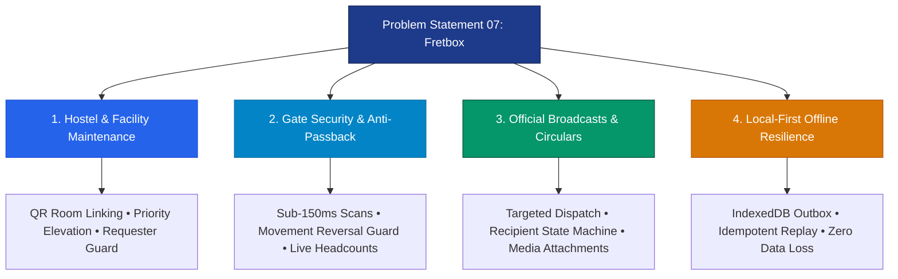

# 🏆 BPUT Hackathon 2026 — Problem Statement 07 Materials

> **Official Competition Briefs, Architectural Prompts & Presentation Scripts**  
> *Developed by **Crystal Studio Labs** for BPUT Hackathon 2026 (Problem Statement 07: Fretbox)*

---

## 🧭 Navigation
[Root README](../../README.md) • [Documentation Hub](../README.md) • [Architecture Guide](../architecture/architecture.md) • [Demo Script](../guides/demo-script.md)

---

## 📂 Materials in this Directory

> [!NOTE]
> This folder consolidates competition requirements, pitch deck generation scripts, and architectural prompts for **Campus Relay**.

| File | Description & Contents | Target Audience |
| :--- | :--- | :--- |
| [`Problem_Statement_7.pdf`](./Problem_Statement_7.pdf) | Official problem statement brief for **Problem Statement 07 (Fretbox)** issued for BPUT Hackathon 2026. | Jury & Review Committee |
| [`ppt.txt`](./ppt.txt) | 10-slide master pitch deck generation prompt calibrated for **Gamma AI**, formatted with industrial brutalism visual language, slide content, speaker notes, and verified system facts. | Pitch Team |
| [`prompt.txt`](./prompt.txt) | Master architectural specification and build prompt defining the engineering requirements, data models, workflows, offline persistence, and role matrix for Campus Relay. | Core Engineers |

---

## 🎯 Quick Reference: PS07 Focus Areas

1. **Hostel & Facility Maintenance**: Fast QR-based fault reporting, room-level linking, technician dispatching, and digital resolution verification.
2. **Gate Security & Curfew Enforcement**: Sub-150ms cryptographic QR pass validation, offline gate scanning, and live outside headcount tracking.
3. **Official Broadcasts & Circulars**: Multi-channel notice distribution (Telegram, WhatsApp, Web, Corridor Kiosks) with guaranteed recipient tracking and mandatory acknowledgement.
4. **Local-First Offline Resilience**: IndexedDB client outbox ensuring zero data loss during basement connectivity dead zones.

---

### 📬 Contact & Institutional Support
- **Lead Organization**: **Crystal Studio Labs**
- **Direct Support & Inquiries**: [`connect.crystalstudio@gmail.com`](mailto:connect.crystalstudio@gmail.com)
- **Competition Track**: BPUT Hackathon 2026 — Problem Statement 07 (Fretbox)
- **Main Repository**: [GitHub: Crystal-Studio-Labs/Campus-Relay](https://github.com/Crystal-Studio-Labs/Campus-Relay)
