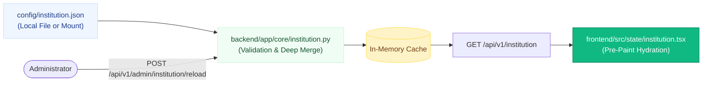

# ⚙️ Institutional Configuration Specification

> **The Zero-Code Customization Engine: `config/institution.json` Reference**  
> *Authored by **Crystal Studio Labs** for BPUT Hackathon 2026 — Problem Statement 07 (Fretbox)*

---

## 🧭 Navigation
[Root README](../../README.md) • [Documentation Hub](../README.md) • [Themes Specification](./THEMES.md) • [UI System](./ui-system.md) • [Setup Guide](../guides/setup-guide.md)

---

Campus Relay is an engineered institutional **template**. A single JSON manifest — **`config/institution.json`** located at the repository root — is the sole difference between the out-of-the-box demonstration campus and your university. Institutional administrators customize operational identity, terminology, accessibility guardrails, and feature flags by editing declarative keys without forking the codebase.

---

## ⚡ Hot-Reload Pipeline

---

## 1. The Thirty-Second Version

1. Inspect `config/institution.json` (a missing file is safe and triggers sensible built-in defaults).
2. Modify properties under `identity` (name, short name, crest, contact email).
3. Notify the running API: click **Reload from disk** in the Admin UI (`/setup`), or invoke `POST /api/v1/admin/institution/reload`.
4. Every surface — landing page, login portals, touch kiosks, and generated PDFs — immediately reflects your institution's branding and vocabulary.

> [!IMPORTANT]
> Zero application recompilation, zero database migrations, zero server restarts.

---

## 2. Component Architecture & Provenance

| Path | Architectural Purpose |
| :-- | :-- |
| `config/institution.json` | Master configuration manifest; safe to commit to version control. |
| `backend/app/core/institution.py` | Validates, deep-merges defaults, and provides fallback schemas. |
| `backend/app/api/v1/institution.py` | Exposes public config (`GET /institution`) and admin management (`POST /reload`). |
| `frontend/src/lib/institution.ts` | Client TypeScript interfaces, defaults mirror, and storage helpers. |
| `frontend/src/state/institution.tsx` | React Context provider applying tokens before first paint. |
| `INSTITUTION_CONFIG_PATH` (env) | Optional environment variable override pointing to an external filesystem path. |

---

## 3. Configuration Reference by Namespace

### `identity` — Institutional Branding
| Key | Example Value | Description & Target Surfaces |
| :-- | :-- | :-- |
| `name` | `Crystal Institute of Technology` | Full legal title; browser window titles, footer, letterheads. |
| `short_name` | `Crystal Institute` | Compact brand plate in the sidebar navigation header. |
| `monogram` | `CIT` (Max 4 chars) | Fallback compact monogram badge. |
| `code` | `CIT` | Prefix used in document serial numbers and tracking codes. |
| `tagline` | One descriptive sentence | Subtitle displayed on sign-in and public landing pages. |
| `kind` | `Institute of Technology` | Institutional classification kicker on landing page. |
| `city`, `region` | `Bhubaneswar`, `Odisha` | Geographical provenance displayed in public footers. |
| `support_email` | `connect.crystalstudio@gmail.com` | Official contact address displayed across stations. |
| `support_phone` | `+91 674 000 0000` | Campus emergency helpline. |
| `website` | `https://cit.edu` | Canonical university domain. |

### `academics` — Calendar & Scheduling
| Key | Default | Description |
| :-- | :-- | :-- |
| `term_label` | `Autumn Semester 2026` | Current term banner displayed across header strips. |
| `timezone` | `Asia/Kolkata` | Canonical timezone used for SLA windows and audit timestamps. |
| `week_starts_on` | `monday` | First day of week for analytics and leave calendar pickers. |

### `localisation` — Multi-Lingual Settings
| Key | Description |
| :-- | :-- |
| `default_language` | Primary default language code (`en`, `or`, `hi`). |
| `languages` | Ordered array of language codes displayed in the user interface switcher. |

### `appearance` — Visual Design Tokens
| Key | Permitted Values | Notes & Fallbacks |
| :-- | :-- | :-- |
| `skin` | `modern`, `industrial`, `govt-portal`, `university-portal` | Active visual design language. (See [`docs/specifications/THEMES.md`](THEMES.md)). |
| `default_theme` | `device`, `light`, `dark` | Default theme for new browser sessions. |
| `allow_user_theme_override` | `true` / `false` | When `false`, locks theme switcher to default. |
| `accent` | Hex CSS colour or `null` | Primary brand accent color applied to `--signal`. Validates contrast automatically. |
| `crest_url` | `/assets/crest.svg` or `""` | URL to official institution crest. Empty defaults to monogram. |
| `direction` | `ltr`, `rtl` | Layout reading direction. Layout engine utilizes CSS logical properties. |

### `vocabulary` — Campus Terminology Overrides
Customize administrative terminology to reflect your college's culture:
- `hostel` ➔ *"Hall of Residence"* / *"Hostel"*
- `block` ➔ *"Wing"* / *"Tower"* / *"Block"*
- `department` ➔ *"School"* / *"Faculty"* / *"Department"*
- `branch` ➔ *"Discipline"* / *"Program"*
- `student` ➔ *"Scholar"* / *"Student"*

### `stations` — Physical Terminal Behavior
| Key | Default | Description |
| :-- | :-- | :-- |
| `kiosk_idle_seconds` | `90` | Inactivity countdown before kiosk session resets (Validated 15–3600s). |
| `kiosk_default_theme` | `light` | High-contrast light theme enforced on lobby kiosks. |
| `helpdesk_channel` | `ASSISTED_DESK` | Audit channel tag recorded for operator proxy submissions. |
| `default_channel` | `PWA` | Audit channel tag recorded for personal smartphone submissions. |

### `features` — Modular Subsystem Toggles
Toggle functional capabilities without code modification:
- `agents`: Controlled AI Intake, Routing, and Operations subsystems.
- `kiosk`: Anonymous Roll Number Touch Kiosk interface (`/kiosk`).
- `gate`: Security Gate Terminal, pass scanning, and anti-passback tracking (`/security`).
- `notices`: Notice Studio, multi-target broadcast, and acknowledgement tracker.
- `offline_sync`: Local-First IndexedDB persistent mutation outbox.

### `guardrails` — Accessibility Standards
| Key | Declared Standard | Operational Guarantee |
| :-- | :-- | :-- |
| `wcag_level` | `AA` | Adheres to WCAG 2.1 AA accessibility guidelines. |
| `min_body_contrast` | `4.5` | Minimum luminance contrast ratio for body text. |
| `min_touch_target_px` | `46` | Minimum physical button hit target for mobile/kiosk touch screens. |
| `status_always_carries_word`| `true` | Status indicators never rely on color alone; always paired with explicit text. |
| `require_audit_reason` | `true` | Mandates human justification notes on administrative overrides. |

---

## 4. Administrative API Surface

| Endpoint | Required Permission | Description |
| :-- | :-- | :-- |
| `GET /api/v1/institution` | Public | Delivers active branding and terminology required for pre-auth views. |
| `GET /api/v1/admin/institution`| `config:manage` | Returns full configuration, active file path, loader warnings, and schema checklist. |
| `POST /api/v1/admin/institution/reload`| `config:manage` | Re-reads JSON manifest from disk, audits reload, and returns updated blocks. |
| `POST /api/v1/admin/institution/identity`| `config:manage` | Live update endpoint utilized by the initial Onboarding Setup Wizard. |

---

## 5. Security Exclusions: What is NOT Configured in this File

> [!CAUTION]
> To prevent privilege escalation and security vulnerabilities, the following areas **cannot** be modified via `institution.json`:
> 1. **Roles & Permissions**: Defined strictly in Python source code (`app/core/permissions.py`) and verified server-side.
> 2. **Master Campus Records**: Students, staff, and facilities are operational records managed via relational database migrations and admin import screens.
> 3. **Infrastructure Secrets**: Passwords, encryption keys, and tokens reside exclusively in `.env`.

---

### 📬 Contact & Institutional Support
- **Lead Organization**: **Crystal Studio Labs**
- **Configuration Assistance**: [`connect.crystalstudio@gmail.com`](mailto:connect.crystalstudio@gmail.com)
- **Competition Track**: BPUT Hackathon 2026 — Problem Statement 07 (Fretbox)
- **Main Repository**: [GitHub: Crystal-Studio-Labs/Campus-Relay](https://github.com/Crystal-Studio-Labs/Campus-Relay)
