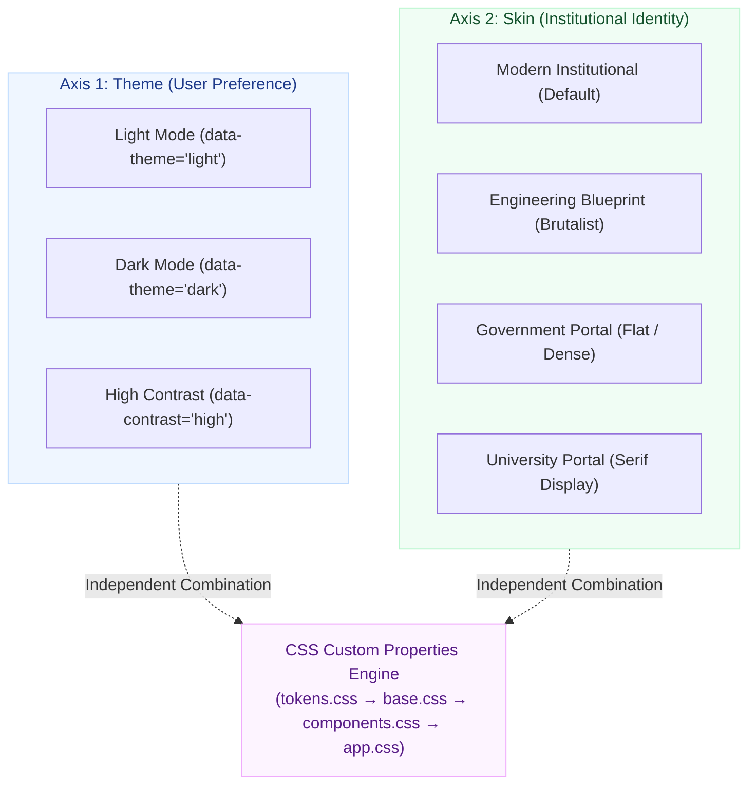

# 🎨 Themes & Design Languages Specification

> **The Dual-Axis Visual Architecture: Themes (Per-Person) × Skins (Per-Institution)**  
> *Authored by **Crystal Studio Labs** for BPUT Hackathon 2026 — Problem Statement 07 (Fretbox)*

[](#the-dual-axis-visual-model)
[](#1-the-four-shipped-design-skins)
[](#accessibility--dark-mode-guardrails)
[](#-contact--institutional-support)

---

## 🧭 Navigation
[Root README](../../README.md) • [Documentation Hub](../README.md) • [UI System](./ui-system.md) • [Configuration](./CONFIGURATION.md) • [Setup Guide](../guides/setup-guide.md)

---

Campus Relay decouples visual styling across two completely orthogonal axes. This fundamental separation allows an institution to overhaul its branding language without compromising individual accessibility preferences or color contrast ratios.

---

## 📐 The Dual-Axis Visual Model



| Visual Dimension | Core Question It Answers | Governed By | HTML Execution Target |
| :-- | :-- | :-- | :-- |
| **Theme** | *How much luminance is emitted from the screen?* | The end-user | `data-theme="light\|dark"` on `<html>`, stored in localStorage. |
| **Skin** | *What structural design language does the campus project?* | The institution | `data-skin="…"` on `<html>`, defined in `config/institution.json`. |
| **Density** | *How compact should operational tables and queues appear?* | The end-user | `data-density="normal\|compact"` on `<html>`. |
| **Text Scale** | *Is enhanced readability or screen magnification needed?* | The end-user | `data-text="normal\|large"` on `<html>`. |

---

## 1. The Four Shipped Design Skins

All four skins are registered in `frontend/src/theme/registry.ts` and selectable via the account settings menu or live `/setup` preview:

### 1. Modern Institutional (Shipped Default)
- **Visual Aesthetic**: Calm, contemporary, and trustworthy; clean white surfaces against a subtle blue-grey canvas.
- **Surface Elevation**: Soft rounded corners (10–22px border radius) paired with gentle diffused drop shadows (`--shadow*`).
- **Color Discipline**: One confident institutional blue for primary action, semantic emerald for completed states, amber for attention.
- **Typography**: Clean sentence-case headings and generous structural whitespace.

### 2. Engineering Blueprint (Industrial Brutalism)
- **Visual Aesthetic**: Rigorous, technical drawing-sheet appearance tailored for lab terminals, engineering workstations, and projector displays.
- **Surface Elevation**: Sharp squared corners (2px radius) and 1–3px solid mechanical border rules.
- **Grid Background**: Faint architectural grid lines (`--grid-line` at 28px intervals with heavy accents every fifth rule).
- **Hazard Accents**: Industrial diagonal hazard striping reserved for brand plates, priority elevation chips, and critical alerts.

### 3. Government Portal (Administrative Density)
- **Visual Aesthetic**: High-density, paper-first, and regulatory; designed to visually align with state and national public service portals.
- **Surface Elevation**: Zero border radius (`--radius: 0px`), 1px hairline rules, zero shadow lifts.
- **Information Density**: Maximized tabular rows per viewport screen.

### 4. University Portal (Traditional Academic Heritage)
- **Visual Aesthetic**: Dignified collegiate presentation designed for universities matching established heritage websites.
- **Typography**: High-authority serif display headings for major banners and mastheads.
- **Measure**: Extended reading measure and integrated institutional heraldic crest slots.

---

## 2. Layered CSS Architecture

```
frontend/src/styles/
  ├── index.css      Manifest importer enforcing strict layer precedence
  ├── tokens.css     Layer 1: Colors, light/dark palettes, and skin token blocks
  ├── base.css       Layer 2: Typography, resets, and layout primitives
  ├── components.css Layer 3: Buttons, cards, status chips, modal sheets, tables
  └── app.css        Layer 4: AppShell, responsive drawer, kiosk views, and stations
```

> [!NOTE]
> **Strict Precedence Rule**: A later stylesheet layer may extend an earlier layer, but is never permitted to re-declare or override tokens owned by an earlier layer.

---

## 3. Accessibility & Dark-Mode Guardrails

Both light and dark palettes adhere to rigorous contrast standards:
- **Body Copy**: Maintains at least a **7:1** contrast ratio against backgrounds.
- **Muted Captions & Status Chips**: Exceeds the **4.5:1** WCAG AA threshold.
- **Measured Colors**: `--muted-ink` is a calibrated, measured hex color — never body text rendered at reduced opacity.
- **Zero Flash of Unstyled Theme (FOUT)**: An inline script in `index.html` evaluates stored preferences and applies `data-theme`, `data-skin`, and `data-text` attributes **prior to first DOM paint**.

---

## 4. How to Add a Custom Institutional Skin

Creating a custom campus skin requires just 4 straightforward steps:

1. **Add Token Block**: In `tokens.css`, define a new `[data-skin='your-skin']` block with your structural overrides (15–20 lines of CSS):
   ```css
   [data-skin='campus-classic'] {
     --radius: 8px;
     --border-w: 1px;
     --plate-lift: 2px;
     --label-transform: uppercase;
     --label-tracking: 0.05em;
     --grid-line: transparent;
   }
   ```
2. **Register Skin**: Add entry to `SKINS` in `frontend/src/theme/registry.ts` with `status: 'shipped'`.
3. **Configure Institution**: Update `appearance.skin` in `config/institution.json`.
4. **Responsive Verification**: Verify layouts across mobile (390px), tablet (768px), and desktop (1280px+).

---

### 📬 Contact & Institutional Support
- **Lead Organization**: **Crystal Studio Labs**
- **Design System Inquiries**: [`connect.crystalstudio@gmail.com`](mailto:connect.crystalstudio@gmail.com)
- **Competition Track**: BPUT Hackathon 2026 — Problem Statement 07 (Fretbox)
- **Main Repository**: [GitHub: Crystal-Studio-Labs/Campus-Relay](https://github.com/Crystal-Studio-Labs/Campus-Relay)
