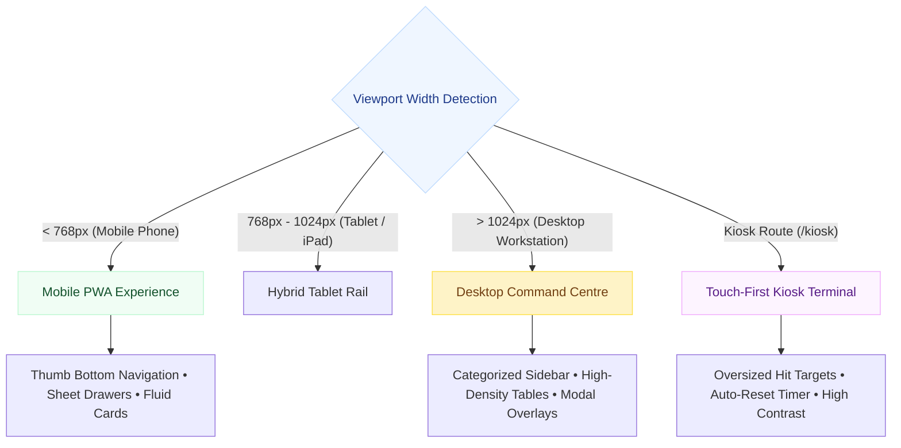

# 🖥️ Frontend UI System & Component Architecture

> **Adaptive Shells, Modular Primitives, Touch Ergonomics & Responsive Layouts**  
> *Authored by **Crystal Studio Labs** for BPUT Hackathon 2026 — Problem Statement 07 (Fretbox)*

[](#the-design-language-bright-institutional)
[](#shared-component-primitives)
[](#accessibility-standards)
[](#-contact--institutional-support)

---

## 🧭 Navigation
[Root README](../../README.md) • [Documentation Hub](../README.md) • [Themes Specification](./THEMES.md) • [Configuration](./CONFIGURATION.md) • [API Specification](./api.md)

---

Campus Relay delivers a unified, highly adaptable user experience across mobile phones, desktop workstations, and physical touch kiosks. The frontend is architected as an **adaptive client of the operational engine**, ensuring that business logic is never duplicated across viewports.

---

## 📱 Responsive Layout Adaptation



---

## 🎨 The Design Language: Bright Institutional

The default design language is **modern institutional**: clean white surfaces on a soft blue-grey canvas, confident blue for primary interaction, semantic emerald for completed states, and amber for attention.
- **Rounded Surfaces**: 10–22px border radii paired with soft elevation (`--shadow*`).
- **Color Discipline**: Status indicators never rely on color alone; every chip pairs semantic hue with explicit text (`OPEN`, `RESOLVED`, `BREACHED`).
- **Tabular Monospace Identifiers** (`.ident`): Ticket IDs (`CR-CASE-001`), room numbers, and asset codes line up cleanly in columns without ambiguous glyphs.
- **Zero Heavy Plate Borders**: Clean whitespace and typography guide user attention to the active task.

---

## 📐 Layered Stylesheet Pipeline

One manifest (`frontend/src/styles/index.css`) imports four layers in strict cascade order:

```
tokens.css  →  base.css  →  components.css  →  app.css
```

| Layer File | Architectural Purpose & Scope |
| :-- | :-- |
| **`tokens.css`** | Global design tokens: brand colors, light/dark palettes, radii, spacing units, and skin blocks. |
| **`base.css`** | CSS reset, base typography rules, focus outlines, and `prefers-reduced-motion` fallbacks. |
| **`components.css`** | Core UI primitives: `.btn`, `.card`, `.panel`, `.badge`, `.table`, form inputs, timeline nodes. |
| **`app.css`** | Layout shells, responsive grids, kiosk stations, and command centre dashboard layouts. |

> [!NOTE]
> No individual React component imports private CSS files. All styling derives predictably from the centralized CSS custom property cascade.

---

## 🧩 Shared Component Primitives (`frontend/src/components/`)

| Component Name | Source File | Description & Capabilities |
| :-- | :-- | :-- |
| **`Button` / `Card` / `Badge`** | `ui.tsx` | Highly optimized, accessible design primitives supporting semantic variants. |
| **`Metric` / `KV`** | `ui.tsx` | Key-value pairs and KPI statistical widgets for administrative dashboards. |
| **`CaseCard`** | `CaseCard.tsx` | Compact, scan-friendly ticket summary card displaying SLA countdown and status. |
| **`NoticeCard`** | `NoticeCard.tsx` | Broadcast circular display with embedded circular photo preview and action buttons. |
| **`Timeline`** | `Timeline.tsx` | Chronological visual history of state changes, technician comments, and audit events. |
| **`OfflineBar`** | `OfflineBar.tsx` | Connectivity banner with deep-link trigger into the local Sync Centre outbox sheet. |
| **`ScanTarget`** | `ScanTarget.tsx` | Camera QR barcode scanner with manual fallback input for low-light conditions. |
| **`Assistant`** | `Assistant.tsx` | Interactive drawer providing natural language inquiries and tool proposals. |

---

## ♿ Accessibility & Ergonomics Standards

- **WCAG 2.1 AA Compliance**: All text elements satisfy minimum 4.5:1 contrast in both light and dark modes.
- **Oversized Touch Targets**: Minimum touch target size `--touch-min: 46px` enforced across mobile and kiosk interfaces.
- **Fluid Table-to-Card Transformation**: Tables incorporate `.table-wrap.become-cards`, automatically morphing into stacked cards on narrow smartphone viewports to eliminate horizontal scrolling.
- **Motion Reduction**: All transitions respect the user's operating system `prefers-reduced-motion` flag.

---

### 📬 Contact & Institutional Support
- **Lead Organization**: **Crystal Studio Labs**
- **UI Architecture Inquiries**: [`connect.crystalstudio@gmail.com`](mailto:connect.crystalstudio@gmail.com)
- **Competition Track**: BPUT Hackathon 2026 — Problem Statement 07 (Fretbox)
- **Main Repository**: [GitHub: Crystal-Studio-Labs/Campus-Relay](https://github.com/Crystal-Studio-Labs/Campus-Relay)
